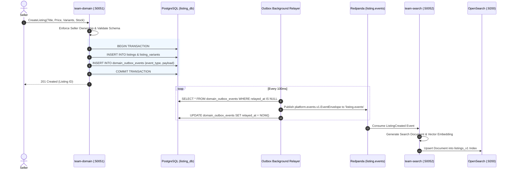
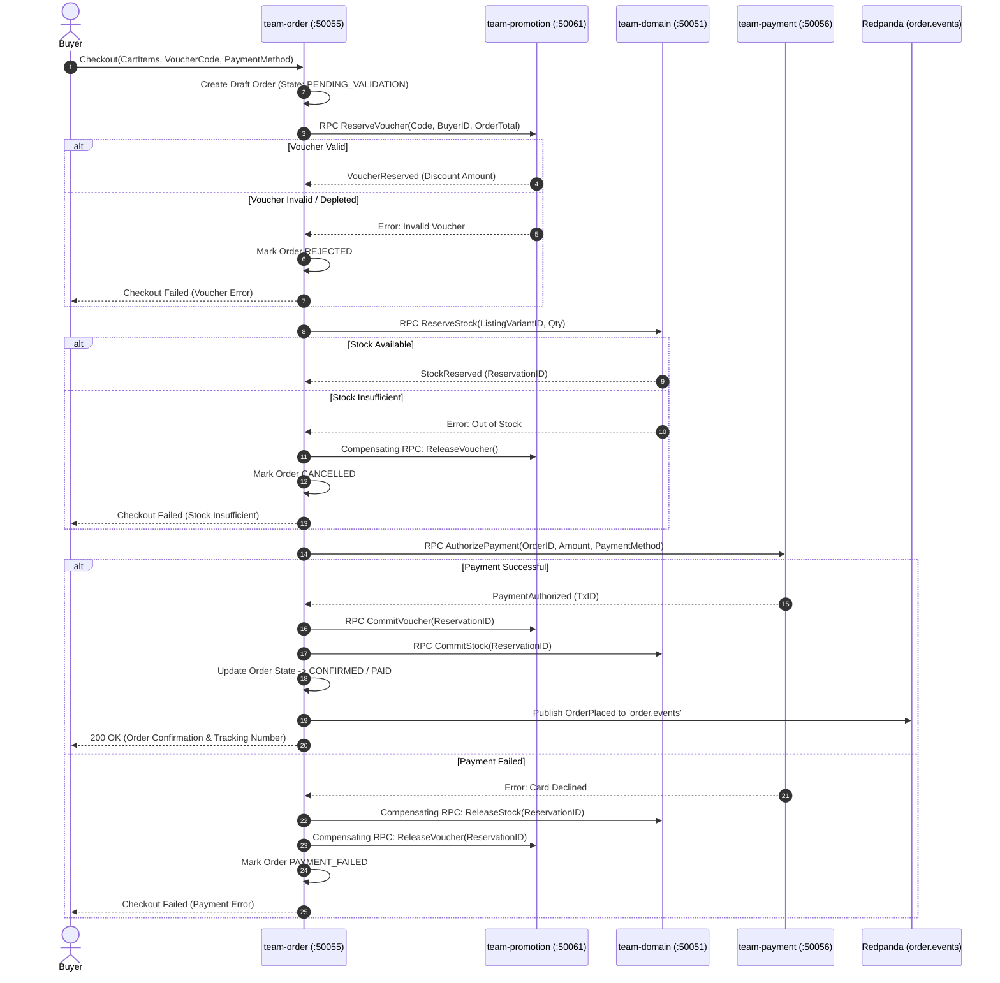

# Agora — AI-First Marketplace Platform

A production-shaped, **event-driven microservices** marketplace (Shopee/Amazon scale architecture) built as a polyrepo of 20 independently deployable services. Browsers and mobile clients interact exclusively through a single Connect/gRPC edge; write-side services emit business events to Kafka via the Transactional Outbox pattern, while dedicated read-side services consume events to maintain query-optimized projections (CQRS). Ships with an AI/RAG shopping assistant, probabilistic seller demand forecasting, Next.js 14 SSR storefront, and automated BDD end-to-end test suites.

> **Stack Matrix:** Go 1.22 · Python 3.11/FastAPI · TypeScript / Next.js 14 App Router · gRPC & Connect-Go · Kafka (Redpanda) · PostgreSQL 16 (DB-per-service) · OpenSearch 2.11 · Qdrant Vector DB · Redis · DuckDB Columnar Lakehouse · Hugging Face TEI / vLLM · Docker Compose · ArgoCD / Helm GitOps

---

## 1. Global High-Level System Architecture

```mermaid
flowchart TD
  subgraph Client_Layer["Client & User Interfaces"]
    Web["Web Browser / Mobile App"]
    NextSSR["team-frontend (Next.js 14 SSR :3000)<br/>• Consumer Storefront & Discovery<br/>• Seller Management Cockpit<br/>• Connect-ES & httpOnly Session Cookie"]
  end

  subgraph Edge_Security["Edge & Security Layer"]
    GW["team-gateway (Connect Edge :8080)<br/>• Single Public Entrypoint<br/>• RS256 JWT & JWKS Verifier (Zero Shared Secrets)<br/>• Token Bucket Rate Limiter & CORS<br/>• Principal Enrichment (x-principal-*)<br/>• Telemetry Beacon Ingestion"]
  end

  subgraph Identity_Auth["Identity & Trust Service"]
    ID["team-identity (:50053 gRPC / :50063 JWKS)<br/>• RS256 Private Key Signer (Vault)<br/>• JWKS Public Key Endpoint<br/>• Role -> Scope Mapping (buyer/seller/admin)<br/>• Sessions & Password Reset"]
  end

  subgraph Core_Domains["Core Business Domain Services (Write-Side / gRPC)"]
    DOM["team-domain (:50051)<br/>• Catalog & Listings<br/>• Stock Reservations<br/>• Transactional Outbox"]
    ORD["team-order (:50055)<br/>• Cart & Checkout<br/>• Distributed Saga Coordinator<br/>• RMA Returns Management"]
    PAY["team-payment (:50056)<br/>• Transaction Ledger<br/>• Escrow Holding<br/>• Seller Wallet Payouts"]
    PRO["team-promotion (:50061)<br/>• Voucher Engine (Reserve/Commit)<br/>• Flash-Sale Campaigns"]
    ENG["team-engagement (:50054)<br/>• Reviews & Ratings<br/>• Favorites & Wishlist<br/>• Community Q&A & Disputes"]
    CHT["team-chat (:50057)<br/>• Real-Time Messaging<br/>• Buyer-Seller Chat Threads"]
    NOT["team-notification (:50058)<br/>• In-App Notifications<br/>• Price-Drop & Order Alerts"]
    AUX["team-referral (:50062) · team-verification (:50064)<br/>team-sharing (:50065) · team-audit (:50066)"]
  end

  subgraph Event_Bus["Asynchronous Event Streaming (Kafka / Redpanda :19092)"]
    K_List["listing.events<br/>(ListingCreated, ListingUpdated, StockReserved)"]
    K_Order["order.events<br/>(OrderPlaced, OrderPaid, OrderShipped, OrderCancelled)"]
    K_Promo["promotion.events<br/>(VoucherClaimed, VoucherRedeemed)"]
    K_Pay["payment.events<br/>(PaymentAuthorized, PaymentSettled, RefundIssued)"]
    K_Tele["analytics.events<br/>(Impressions, PDP Views, Cart Adds, Checkouts)"]
  end

  subgraph Read_Models["CQRS Read Models, Search & Analytics"]
    SRC["team-search (:50052)<br/>• OpenSearch 2.11 Read Projection<br/>• Hybrid BM25 + Dense Vector Search<br/>• Reciprocal Rank Fusion (RRF)<br/>• Facets & Autocomplete Suggester"]
    ANA["team-analytics (:50059)<br/>• DuckDB Columnar Parquet Warehouse<br/>• 5-Step Conversion Funnel Metrics<br/>• Probabilistic Demand Forecast (P10/P50/P90)"]
  end

  subgraph AI_MLOps["AI & Recommendation Ecosystem"]
    AI["team-ai (:8000 FastAPI)<br/>• RAG Shopping Assistant<br/>• Magic Listing Generator<br/>• Review Summarization"]
    RECSYS["platform-recsys<br/>• Offline ALS Matrix Factorization<br/>• Two-Tower Deep Retrieval<br/>• Candidate Indexing into Qdrant"]
    MODELS["platform-modelserve (:8100 Router)<br/>• TEI Embeddings (:8101)<br/>• TEI Rerank (:8102)<br/>• vLLM Generator (:8103)"]
  end

  subgraph Persistence["Isolated DB-per-Service Storage Tier"]
    PG_ID[("PostgreSQL<br/>identity_db :5435")]
    PG_DOM[("PostgreSQL<br/>listing_db :5433")]
    PG_ORD[("PostgreSQL<br/>order_db :5437")]
    PG_PAY[("PostgreSQL<br/>payment_db :5438")]
    PG_PRO[("PostgreSQL<br/>promotion_db :5440")]
    PG_ENG[("PostgreSQL<br/>engagement_db :5436")]
    PG_NOT[("PostgreSQL<br/>notification_db :5441")]
    OS_DB[("OpenSearch<br/>:9200")]
    QD_DB[("Qdrant Vector<br/>:6333")]
    REDIS_DB[("Redis Cache<br/>:6379")]
    PARQUET_DB[("Parquet Lakehouse<br/>data/analytics/*.parquet")]
  end

  %% Ingress flows
  Web --> NextSSR
  Web -->|Direct Connect-Web| GW
  NextSSR -->|gRPC / Connect| GW

  %% Edge security routing
  GW -.->|Fetch Public JWKS| ID
  GW -->|Trusted x-principal-*| Core_Domains
  GW -->|Forward Search Query| SRC
  GW -->|Forward AI / RAG Query| AI
  GW -->|Forward Analytics Query| ANA
  GW -->|Forward Beacon Telemetry| K_Tele

  %% Identity persistence
  ID --> PG_ID

  %% Write domains persistence & outbox emission
  DOM --> PG_DOM
  ORD --> PG_ORD
  PAY --> PG_PAY
  PRO --> PG_PRO
  ENG --> PG_ENG
  NOT --> PG_NOT

  DOM -- Transactional Outbox --> K_List
  ORD -- Transactional Outbox --> K_Order
  PRO -- Events --> K_Promo
  PAY -- Events --> K_Pay

  %% Event consumption & CQRS
  K_List --> SRC
  K_List --> RECSYS
  K_Order --> ANA
  K_Order --> NOT
  K_Tele --> ANA
  K_Tele --> RECSYS

  %% Read model storage
  SRC --> OS_DB
  SRC --> QD_DB
  ANA --> PARQUET_DB
  RECSYS --> QD_DB
  RECSYS --> REDIS_DB

  %% AI & ML model invocation
  AI --> MODELS
  SRC --> MODELS
```



---

## 2. Key Architecture Pillars

### 1. Single Authenticating Edge & Zero-Trust Metadata Propagation (ADR-0003, ADR-0006)
- **Token Verification:** `team-gateway` is the **only** entity that verifies client JWT tokens. It downloads and caches public keys from `team-identity` via `GET /.well-known/jwks.json` (:50063).
- **Zero Shared Secrets:** No shared HMAC secret keys exist between services. Private signing keys remain strictly in Vault and `team-identity`.
- **Trusted Principal Context:** Upon verifying the bearer token by key ID (`kid`), `team-gateway` strips external auth headers and injects trusted gRPC metadata:
  - `x-principal-id`: Unique User/Actor UUID
  - `x-principal-type`: `buyer` | `seller` | `admin` | `anonymous`
  - `x-principal-scopes`: Canonical scope array (e.g. `listing:write`, `order:create`, `admin:all`)
- Downstream Go services enforce access via the `RequireScopes` interceptor without re-parsing JWTs.

### 2. CQRS & Transactional Outbox Pattern (ADR-0005)


### 3. Distributed Purchase Saga Orchestration (ADR-0002)


### 4. AI & MLOps Architecture (ADR-0011, ADR-0013)
- **Telemetry Ingestion:** Client beacons (`/api/v1/telemetry`) capture GA4 ecommerce events (`view_item_list`, `view_item`, `add_to_cart`, `begin_checkout`, `purchase`) and stream into `analytics.events`.
- **Probabilistic Demand Forecasting:** `team-analytics` queries DuckDB Parquet historical sales and runs quantile regressions ($P_{10}$ pessimistic, $P_{50}$ median, $P_{90}$ optimistic), computing dynamic safety stock and Reorder Points (ROP) for sellers.
- **Hybrid Search & Recommendation:** `team-search` combines lexical BM25 token matching with dense embeddings retrieved from `platform-modelserve` TEI (:8101) via Reciprocal Rank Fusion (RRF).
- **Two-Tower & ALS RecSys:** `platform-recsys` processes implicit user-item interaction matrices to index top-k candidate vectors into Qdrant (:6333).

---

## 3. Polyrepo Services Directory & Port Allocation

| Repository | Language / Framework | Primary Role & Bounded Context | Internal Ports | Database & Storage |
|---|---|---|---|---|
| **team-gateway** | Go 1.22 / Connect-Go | Public Edge, RS256 JWKS token verifier, rate limiter, forwarder | `:8080` (HTTP/Connect) | Redis `:6379` (Rate limits & cache) |
| **team-frontend** | Next.js 14 / TypeScript | SSR consumer storefront, seller management console, auth session | `:3000` (HTTP) | httpOnly session cookie |
| **team-identity** | Go 1.22 / gRPC | Auth provider, RS256 token minting, JWKS server, sessions, KYC | `:50053` (gRPC), `:50063` (HTTP) | PostgreSQL `identity_db` (:5435) |
| **team-domain** | Go 1.22 / gRPC | Catalog, listings, SKU variants, stock reservation, outbox | `:50051` (gRPC) | PostgreSQL `listing_db` (:5433) |
| **team-search** | Go 1.22 / gRPC | CQRS search engine, hybrid BM25 + kNN vector search, facets | `:50052` (gRPC) | OpenSearch `:9200`, Qdrant `:6333` |
| **team-order** | Go 1.22 / gRPC | Cart, distributed purchase Saga, shipment tracking, RMA returns | `:50055` (gRPC) | PostgreSQL `order_db` (:5437) |
| **team-payment** | Go 1.22 / gRPC | Double-entry ledger, mock payments, escrow hold, seller wallet | `:50056` (gRPC) | PostgreSQL `payment_db` (:5438) |
| **team-promotion**| Go 1.22 / gRPC | Voucher lock engine (reserve/commit/release), flash-sale campaigns | `:50061` (gRPC) | PostgreSQL `promotion_db` (:5440) |
| **team-engagement**| Go 1.22 / gRPC | Reviews (verified badge), favorites/wishlists, Q&A, disputes | `:50054` (gRPC) | PostgreSQL `engagement_db` (:5436) |
| **team-chat** | Go 1.22 / gRPC | Real-time buyer-seller chat threads, streaming messages | `:50057` (gRPC) | PostgreSQL `chat_db` (:5439) |
| **team-notification**| Go 1.22 / gRPC | In-app notification center, price drop alerts, notification prefs | `:50058` (gRPC) | PostgreSQL `notification_db` (:5441) |
| **team-analytics** | Go 1.22 / gRPC | Telemetry consumer, conversion funnels, AI demand forecasting | `:50059` (gRPC) | DuckDB Columnar Parquet |
| **team-ai** | Python 3.11 / FastAPI | RAG shopping assistant, magic listing generator, summarization | `:8000` (HTTP) | Vector Embeddings & LLM Context |
| **platform-modelserve** | Python 3.11 / FastAPI | Unified ML model serving router (Hugging Face TEI / vLLM) | `:8100` (Router), `:8101-:8103` | Local GPU / CPU weights |
| **platform-recsys** | Python 3.11 | Offline ALS collaborative filtering, Two-Tower embedding trainer | — | Qdrant `:6333`, Redis `:6379` |
| **platform-core** | Protobuf / Buf v2 | Single source of truth for contracts, ADRs, Docker compose | — | — |
| **platform-e2e** | Python / pytest-bdd | Playwright + BDD end-to-end testing platform across all flows | — | Test fixtures & seed data |

---

## 4. Local Development & Quickstart

### Prerequisites
- Docker & Docker Compose v2+
- Python 3.10+ (for test and seed tools)
- Node.js 18+ (for frontend development)

### 1. Boot the Entire Microservices Mesh
```bash
# Start all databases, search engines, message brokers, and microservices
docker compose -f docker-compose.services.yaml up --build -d

# Verify all containers are healthy
docker ps --format "table {{.Names}}\t{{.Status}}\t{{.Ports}}"
```

### 2. Seed Realistic Demo Marketplace Data
```bash
# Seeds 5 official stores, 10 buyers, 50+ localized products, vouchers, 500+ telemetry events, and 30-day order history
./platform-core/tools/seed-full.sh
```

### 3. Verify Live User Journeys
```bash
# Runs 5 end-to-end live customer & seller journeys through the Gateway in ~2 seconds
python3 platform-core/tools/run_live_user_journeys.py
```

### 4. Run Full BDD End-to-End Test Suite
```bash
# Runs pytest-bdd test suite covering 100% of capabilities defined in FEATURES.yaml
make -C platform-e2e test
make -C platform-e2e features-check
```

---

## 5. Security & Governance Rules

1. **Edge Isolation:** Downstream services are never exposed directly to external networks. All traffic flows through `team-gateway`.
2. **Contract Authority:** APIs are defined only in `platform-core/packages/proto`. No hand-edited generated files.
3. **DB-Per-Service:** Zero cross-service database access. Cross-domain queries must use gRPC RPCs.
4. **Asynchronous Decoupling:** Event notifications flow through Kafka (`<domain>.events`). Background worker jobs flow through RabbitMQ.
