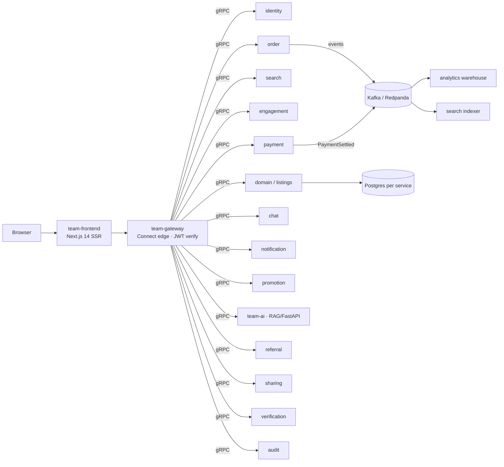

# Agora — AI-first Marketplace Platform

A production-shaped, **event-driven microservices** marketplace (Shopee-style) built as a polyrepo of ~20 independently-deployable services. Browsers reach a single Connect/gRPC edge; write-side services emit Kafka events that read-side services consume (CQRS). Ships with an AI/RAG assistant, a Next.js 14 SSR storefront, and full end-to-end test coverage.

> Stack: **Go · Python/FastAPI · TypeScript/Next.js 14 · gRPC + Connect · Kafka (Redpanda) · PostgreSQL (DB-per-service) · OpenSearch · Qdrant · Redis · Docker Compose · ArgoCD/Helm GitOps**

---

## Architecture



- **One edge:** browsers only ever talk to `team-gateway` (JWT/JWKS verify, RS256); services never expose themselves publicly.
- **Contract-first:** all APIs are Protobuf in `platform-core`; each service vendors + codegens locally (ADR-0001).
- **Event-driven + CQRS:** transactional outbox → Kafka → read models (search index, analytics warehouse).
- **DB-per-service:** every stateful service owns its own PostgreSQL.
- **GitOps:** `platform-gitops` (ArgoCD + Helm) renders per-env deployments.

## Services

| Service | Lang | Responsibility |
|---|---|---|
| team-gateway | Go | Connect/gRPC edge, the only JWT verifier |
| team-frontend | TS/Next.js | SSR storefront + seller console |
| team-identity | Go | Auth (RS256/JWKS), addresses, sessions/KYC |
| team-domain | Go | Listings, storefronts, bundles (transactional outbox) |
| team-search | Go | OpenSearch search, facets, autocomplete, saved searches |
| team-engagement | Go | Favorites, reviews, Q&A, follow, loyalty, recently-viewed |
| team-order | Go | Cart, checkout saga, shipment tracking, returns, reorder |
| team-payment | Go | Mock payments, seller wallet + payouts |
| team-chat | Go | Buyer↔seller messaging, rich messages, message search |
| team-notification | Go | Notifications, price-drop alerts, preferences + digest |
| team-promotion | Go | Vouchers, flash-sale, subscriptions, sponsored ads |
| team-analytics | Go | Kafka→warehouse (DuckDB/BigQuery), seller analytics |
| team-ai | Python | RAG assistant, magic-listing, review summarization |
| team-referral / team-sharing / team-audit / team-verification | Go | Referrals, share links, audit log, KYC |
| platform-core | Proto/Buf | API contracts, ADRs, infra, seed |
| platform-e2e | Python | pytest-bdd + Playwright end-to-end suite |
| platform-gitops | Helm/ArgoCD | GitOps deployment manifests |

## Features (highlights)

Buyer: search + faceted filters + autocomplete · saved searches · cart & saga checkout · order tracking timeline · returns/refunds · reorder · reviews & ratings · listing Q&A · follow sellers + feed · loyalty check-in (streak/coins) · recently-viewed · price-drop alerts · rich chat + message search · AI shopping assistant · referrals · share links.

Seller: storefront · bundles/combos · sponsored ads · subscription tiers · **wallet + payouts** · analytics dashboard · KYC verification.

Platform: RS256/JWKS auth · feature flags (OpenFeature/Flipt) · transactional outbox · audit log · notification preferences + digest.

## Running locally

```bash
docker compose -f docker-compose.services.yaml up --build   # brings up the full stack
# storefront: http://localhost:3000   ·   gateway: http://localhost:8080
```

Seeded users: `buyer1` / `seller1` (password `pass123`).

## Testing

```bash
make -C platform-e2e test          # pytest-bdd + Playwright, against the running stack
make -C platform-e2e features-check # coverage manifest gate
```

Per service: `make test` (Go/Python). Contract lint: `cd platform-core && make check` (buf).

---

*Built as an architecture showcase: contract-first APIs, event-driven CQRS, DB-per-service, one authenticating edge, and end-to-end tests over a real running stack.*
