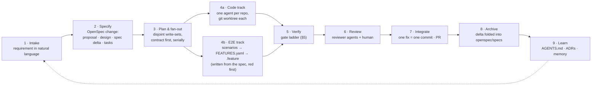

# Agora — an ASDLC for scaling a polyrepo with AI agents

**Agora is a working reference for an _Agentic Software Development Life Cycle_ (ASDLC).**
It is a standard for letting AI coding agents build and maintain a large multi-service system
without the system drifting, breaking its own rules, or passing tests that prove nothing.

The marketplace itself (24 repositories: Go gRPC services, a Next.js storefront, Kafka/CQRS,
a recommender pipeline) is the **testbed**. It is big and coupled enough that unstructured
"prompt and hope" development fails quickly. What this repository shows is the lifecycle, the
guardrails and the evidence that keep agent output correct as it scales.

| | |
|---|---|
| Repositories coordinated | **24** (`team-*` services, `platform-*` platforms) |
| Commits on the current integration branch | **327**, of which **286** are agent co-authored |
| Requirement changes run through the lifecycle | **59** OpenSpec changes (23 archived, 36 in flight) · **13** capability specs |
| Capabilities with a machine-readable contract | **205** `FEATURES.yaml` entries, **187 automated (91%)** |
| End-to-end suite | **89** `.feature` files · **237** scenarios in the parallel lane + a serial destructive lane, against the real stack |
| Guardrails | **11** skills · **2** reviewer sub-agents · **3** hooks · **2** drift/plan validators · **14** ADRs |

---

## 1. Why an ASDLC

Agents scale the **output** of engineering: more code, more repos and more changes per day.
They do not scale **correctness** on their own. Without a lifecycle, a polyrepo fails in
predictable ways:

| Failure mode | What it looks like | Where this ASDLC stops it |
|---|---|---|
| Layer drift | A service exists but is missing from compose or the port map; a proto changed but consumers were not regenerated | `repo_doctor` + the `drift-check` hook (§3) |
| Boundary violations | The frontend calls a service directly; a service reads another service's DB | Rules in `AGENTS.md` + the `contract-boundary-reviewer` agent |
| Contract forks | Generated code edited by hand to "make it compile" | The `guard-generated` PreToolUse hook blocks the edit |
| Unverified claims | "Done" with no test, or tests written after the fact to match the code | Spec scenario ↔ `FEATURES.yaml` ↔ `.feature` mapping; archive is gated on green e2e |
| Tests that test mocks | Green suites that never touch the system | Black-box rule: e2e runs the real stack and the real job images (§5) |
| Flakes hiding bugs | "Retry until green" | Flake triage protocol: repeated parallel runs, root cause, one fix per commit |
| Silent spec drift | Implementation diverges and nobody updates the requirement | MODIFIED spec deltas are part of the same change |

## 2. The lifecycle


```mermaid
flowchart LR
  I["1 · Intake<br/>requirement in natural language"] --> S["2 · Specify<br/>OpenSpec change:<br/>proposal · design · spec delta · tasks"]
  S --> P["3 · Plan & fan-out<br/>disjoint write-sets,<br/>contract first, serially"]
  P --> C["4a · Code track<br/>one agent per repo,<br/>git worktree each"]
  P --> E["4b · E2E track<br/>scenarios → FEATURES.yaml → .feature<br/>(written from the spec, red first)"]
  C --> V["5 · Verify<br/>gate ladder (§5)"]
  E --> V
  V --> R["6 · Review<br/>reviewer agents + human"]
  R --> M["7 · Integrate<br/>one fix = one commit · PR"]
  M --> A["8 · Archive<br/>delta folded into openspec/specs"]
  A --> L["9 · Learn<br/>AGENTS.md · ADRs · memory"]
  L -.-> I
```

| Phase | Artifact | Who | Exit gate |
|---|---|---|---|
| 1 Intake | One sentence of intent | Human | Ambiguities that change scope are asked, not guessed |
| 2 Specify | `openspec/changes/<id>/` with `#### Scenario:` blocks | Agent (`openspec-propose`) | `openspec validate <id> --strict` |
| 3 Plan | Tasks split into a code track per repo and an e2e track | Agent (`spec-dispatch`; `validate_plan.py` for parallel-scrum plans) | No overlapping write-sets; a proto change lands first, alone |
| 4a Code | Commits in one repo | Sub-agent in its own worktree | Repo-local CI-equivalent checks (`go vet/test`, `ruff`, `tsc`, …) |
| 4b E2E | `FEATURES.yaml` entries, `.feature` files and steps | Agent (`spec-to-e2e`) | Every scenario has an automated test (red is allowed until the code lands) |
| 5 Verify | Green runs against the real stack | Agent | The gate ladder in §5 |
| 6 Review | Findings | `contract-boundary-reviewer`, `auth-scope-reviewer`, human | No blocking finding |
| 7 Integrate | Commit per fix, with the evidence in the message; PR | Agent (commit), human (push / merge approval) | Human approval for anything outward-facing |
| 8 Archive | Delta merged into `openspec/specs/` | Agent (`openspec-archive-change`) | `make -C platform-e2e spec-check CHANGE=<id>` |
| 9 Learn | Updated rules, ADRs and operating notes | Agent + human | The next change starts from the corrected map |

## 3. The control plane: what makes it scale

Agents are interchangeable; the **control plane** is not. Every agent (Claude Code, Cursor,
Codex, …) starts from the same map and is held by the same deterministic rails.

**One map, portable across agents.** [`AGENTS.md`](AGENTS.md) holds the repo map, the
five non-negotiable rules and the recipe for adding a feature. `openspec/config.yaml` injects
the same rails into every spec an agent writes. Architecture truth lives in
[`platform-core/docs`](platform-core/docs) and its ADRs; `AGENTS.md` points there instead
of duplicating it.

**Deterministic hooks.** These run on every edit and do not rely on the agent remembering
the rules (`.claude/hooks/`):

| Hook | When | Effect |
|---|---|---|
| `guard-generated.sh` | Before any edit | **Blocks** hand edits to generated code or proto forks outside `platform-core` |
| `format.sh` | After an edit | Formats with whatever toolchain is present; never fails the edit |
| `drift-check.sh` | After editing compose, the port table, a `.proto` or `buf.gen.yaml` | Runs `repo_doctor`; silent when clean, loud on runtime-breaking drift |

**Skills.** Each turns a recurring procedure into one repeatable command
(`.claude/skills/`):

| Skill | Procedure it standardizes |
|---|---|
| `openspec-propose` / `-explore` / `-update-change` / `-apply-change` / `-sync-specs` / `-archive-change` | The spec lifecycle, phases 2 and 8 |
| `spec-dispatch` | Fan out an approved change: code track per repo ∥ e2e track, then converge on the gate |
| `spec-to-e2e` | Scenario → `FEATURES.yaml` → `.feature` + steps + page objects → run → flip to `automated` |
| `proto-change` | Edit the contract once, `buf lint`/`breaking`, regenerate, propagate to every consumer |
| `new-go-service` | Stamp a new bounded context from the sanctioned template and register it everywhere |
| `repo-doctor` | One coherence sweep across compose, ports, contracts, specs and plans |

**Reviewer sub-agents.** These are narrow reviewers that a generic review misses
(`.claude/agents/`):
- `contract-boundary-reviewer`: gateway-only edge, DB-per-service, the right broker, no forked contract.
- `auth-scope-reviewer`: every RPC is scope-gated; the principal cannot be spoofed; no verifier outside the gateway.

**Validators.** `scripts/repo_doctor.py` (static cross-repo drift) and `scripts/validate_plan.py`
(parallel plans: locked spec, no write-set overlap, no `[UNRESOLVED]` left).

## 4. Parallelism model

Parallel agents are only useful if they do not collide. The standard is isolation at every
layer:

1. **Requirement isolation.** One change is one directory (`openspec/changes/<id>/`). N changes
   can be authored and built at the same time with near-zero merge conflicts.
2. **Track isolation.** Inside a change the code track (per repo) and the e2e track (written
   from the spec) run concurrently. The gate is the sync point, not task ordering.
3. **Workspace isolation.** Each code sub-agent works in its own git worktree on its own
   branch. The integrator reads the diff, runs the checks, and merges.
4. **Contract serialization.** A proto change is the one thing that never fans out: it lands
   first, alone, then consumers are fanned out.
5. **Runtime isolation.** Each checkout runs its own compose project and never shares
   containers, volumes or ports with another stack. Inside the e2e suite, parallel workers that
   touch shared stores get private namespaces (for example Redis DB `10+N` and per-worker
   Qdrant collections for the recommender pipeline scenarios).
6. **Resource hygiene.** Heavy environments that a task does not need (for example the local
   GitOps cluster) stay off during e2e. Contention showed up as flakes, not as slowness.

## 5. Verification standard (Definition of Done)

A change is done when **all** of these hold. "The code looks right" is not one of them.

**Traceability**
- [ ] Every user-facing `#### Scenario:` maps 1:1 to a `FEATURES.yaml` acceptance line and a
      `.feature` scenario (`make -C platform-e2e features-check`).
- [ ] When the implementation reveals that the requirement was wrong, the change carries a
      `MODIFIED` spec delta. The spec never silently diverges from the code.

**Real-system testing**
- [ ] E2E runs against the real stack through the public edge. Offline jobs run as their real
      container images, as a black box. No in-process mocks stand in for the system under test.
- [ ] Assertions check what the spec promises (state left in the stores, decisions and their
      reasons), not proxies that happen to be true.
- [ ] Known gaps are `xfail(strict=True)` with a reason that names the missing piece. Strict
      means the marker must be removed the moment the gap closes. No silent `skip`.
- [ ] Security properties are probed, not assumed. For example: can user A act on user B's
      resource through the gateway?

**Stability**
- [ ] The full suite is green on **repeated** parallel runs (`-n 4`); destructive scenarios run
      in a serial lane.
- [ ] Every flake is root-caused. Typical classes are hydration races (an action before React
      attaches handlers is solved by a readiness wait, `BasePage.wait_until_interactive`, never
      a sleep), shared mutable state, and timing assumptions about telemetry export.

**Integration**
- [ ] The CI-equivalent checks for each touched repo are run locally before committing.
- [ ] **One fix = one commit.** The message states the cause, the change and the checks
      that were run.
- [ ] Pushes, PRs, destructive operations and anything outward-facing wait for explicit
      human approval.

## 6. Human in the loop

Agents execute; humans own decisions with consequences outside the repository:

| Decision | Owner |
|---|---|
| Scope trade-offs, product behaviour changes | Human (the agent proposes options with a recommendation) |
| Push, open or merge PRs, publish anything | Human approval, per action |
| Destructive operations (deleting volumes or clusters, force pushes) | Human approval; reversible alternatives offered first |
| Legal and privacy defaults (consent mode, data retention) | Human; explicitly deferred, never changed by an agent |
| Secrets | Never in git; dev defaults only where overridable |

## 7. Evidence: what the lifecycle caught

The standard is justified by the defects it surfaced, not by its diagrams. Examples from one
stabilization wave on this branch:

| Practice | Defect it surfaced |
|---|---|
| Root-causing flakes instead of retrying | Kafka consumers in two services **silently stopped** on a fetch timeout; notifications and order events stopped flowing |
| Probing authorization through the edge | **IDOR**: any signed-in user could book a payout from any seller's wallet to their own bank account |
| Turning a strict `xfail` green instead of keeping it | Seven broken links in the recommender path: warehouse on `/tmp`, missing export, a vanished base image, evaluation always on an empty set, an unregistered RPC, a servicer coded against a guessed contract, wrong vector ids |
| Replacing mock-based pipeline tests with black-box job runs | Two **spec violations**: unevaluable runs were still promoted, and gate decisions were not auditable |
| Auditing metrics, not just tests | **Data leakage** in offline evaluation: ndcg@10 went from 0.75 (leaky) to 0.08 (honest). The protocol is now versioned so the gate never compares across protocols |

Each row is one or more commits on this branch with the evidence in the message.

## 8. The testbed

An AI-first marketplace (Shopee-like) built as a polyrepo. `platform-core` owns the gRPC
contract, infrastructure and ADRs; each `team-*` repository owns exactly one bounded context
and its own database. Browsers reach services only through `team-gateway`. Write-side services
publish Kafka events through a transactional outbox, and read-side services build projections
(CQRS). The AI side is a RAG assistant plus an ALS recommender trained offline from tracked
events.

- Architecture and protocols per hop: [`platform-core/docs/ARCHITECTURE.md`](platform-core/docs/ARCHITECTURE.md)
- Decisions: [`platform-core/docs/ADR/`](platform-core/docs/ADR)
- Repository map, ports and rules: [`AGENTS.md`](AGENTS.md)
- Data, infrastructure, security, UI system: [`platform-core/docs/`](platform-core/docs)

## 9. Using the lifecycle

```bash
# Specify
/opsx:propose "<requirement>"                       # in Claude Code; produces openspec/changes/<id>/
openspec validate <id> --strict

# Build (fan out code ∥ e2e), then verify
#   skill: spec-dispatch <id>
make -C platform-e2e features-check                 # manifests + coverage
make -C platform-e2e spec-check CHANGE=<id>         # every scenario of the change is green
python scripts/repo_doctor.py --root .              # cross-repo drift

# Run the system the tests run against
docker compose up -d --build                        # whole stack, one command
docker compose --profile jobs run --rm platform-recsys   # offline recommender training

# Archive
openspec archive <id>
```

New to the repository, whether human or agent? Read [`AGENTS.md`](AGENTS.md) first, then
[`SPEC_DRIVEN_WORKFLOW.md`](SPEC_DRIVEN_WORKFLOW.md).

## 10. Known gaps in the standard

- **Gates run locally, not in hosted CI.** There is no root GitHub Actions workflow yet, so a
  PR shows no checks. Mirroring the gate ladder into CI is the next step.
- **36 changes are in flight.** Several are blocked only on environment-bound verification
  (live cluster, CI builds); see `openspec/ARCHIVE-STATUS.md`.
- **Flake protection is per-pattern.** Readiness waits are applied where races were observed;
  a suite-wide hydration signal from the frontend would remove the class entirely.
