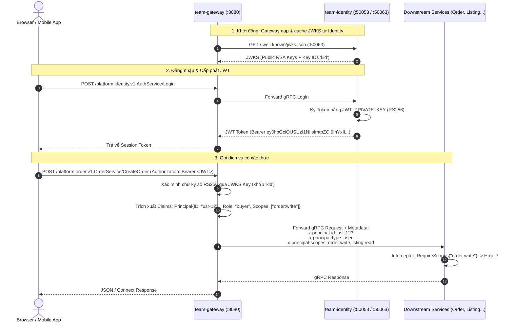
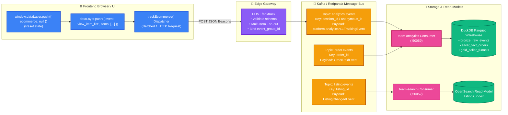
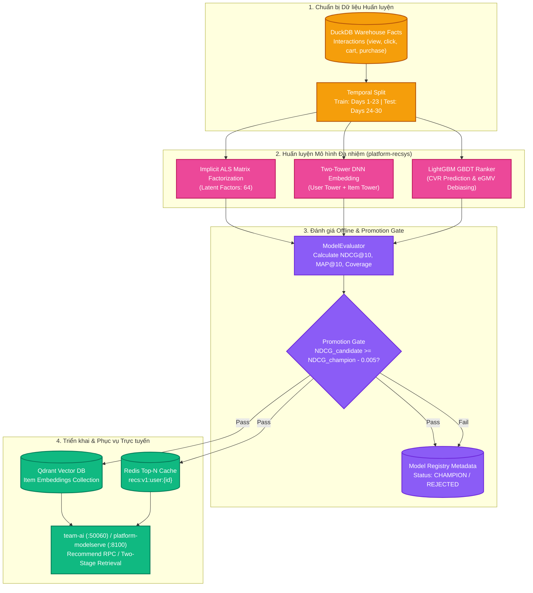
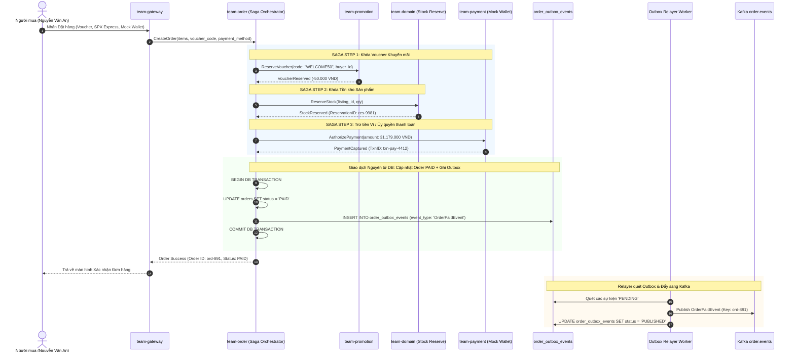
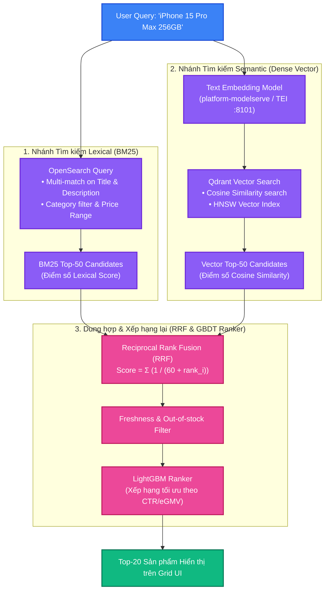
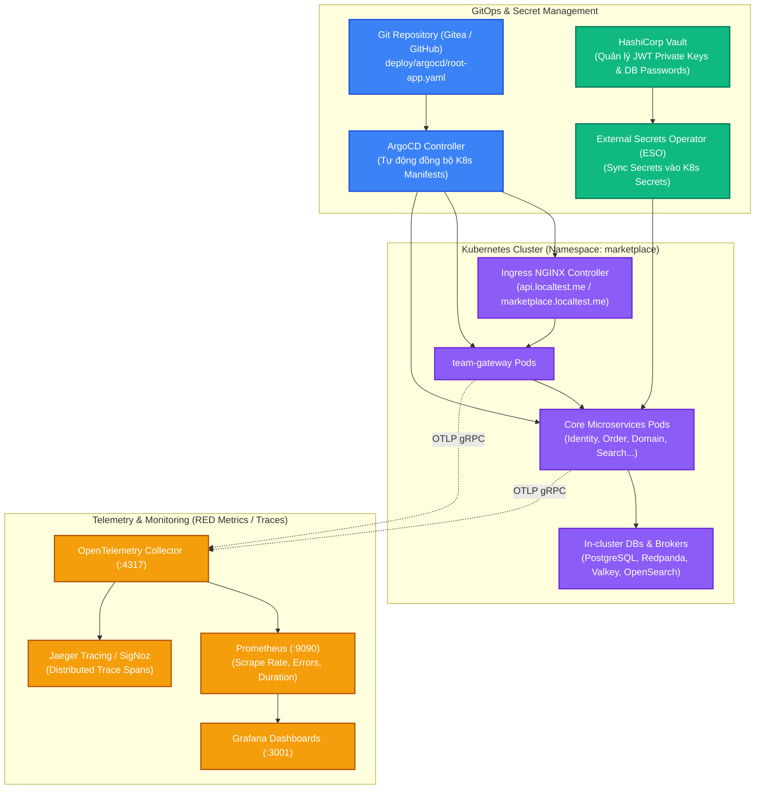

# 🏛️ HỆ THỐNG KIẾN TRÚC TOÀN DIỆN AGORA MARKETPLACE (SYSTEM & PER-APP DIAGRAMS)

> Bộ thiết kế sơ đồ kiến trúc chuẩn doanh nghiệp (Enterprise-Grade Architecture Diagrams) cho nền tảng **Agora Polyrepo AI-First Marketplace**, lấy cảm hứng từ các pipeline MLOps & E-commerce phân tán hiện đại.

---

## 📑 MỤC LỤC SƠ ĐỒ

1. [🌐 SƠ ĐỒ TỔNG THỂ TOÀN BỘ HỆ THỐNG (ALL-IN-ONE ARCHITECTURE)](#1-sơ-đồ-tổng-thể-toàn-bộ-hệ-thống-all-in-one-architecture)
2. [🚪 EDGE GATEWAY & BẢO MẬT ZERO-TRUST (CONNECT EDGE + RS256 JWKS)](#2-edge-gateway--bảo-mật-zero-trust-connect-edge--rs256-jwks)
3. [⚡ PIPELINE DỮ LIỆU & TELEMETRY (GA4 DATALAYER + CQRS + KAFKA + WAREHOUSE)](#3-pipeline-dữ-liệu--telemetry-ga4-datalayer--cqrs--kafka--warehouse)
4. [🧠 MLOPS & PIPELINE HUẤN LUYỆN / PHỤC VỤ MÔ HÌNH (RECSYS + FORECASTING + MODELSERVE)](#4-mlops--pipeline-huấn-luyện--phục-vụ-mô-hình-recsys--forecasting--modelserve)
5. [🔄 FEATURE STORE & ONLINE/OFFLINE FEATURE SERVING](#5-feature-store--onlineoffline-feature-serving)
6. [💳 DISTRIBUTED SAGA & TRANSACTIONAL OUTBOX (ORDER + PROMOTION + PAYMENT)](#6-distributed-saga--transactional-outbox-order--promotion--payment)
7. [🔍 HYBRID SEARCH RETRIEVAL & VECTOR SEARCH ENGINE](#7-hybrid-search-retrieval--vector-search-engine)
8. [📊 OBSERVABILITY & GITOPS K8S CLUSTER DEPLOYMENT](#8-observability--gitops-k8s-cluster-deployment)

---

## 1. 🌐 SƠ ĐỒ TỔNG THỂ TOÀN BỘ HỆ THỐNG (ALL-IN-ONE ARCHITECTURE)

Sơ đồ thể hiện toàn bộ các tầng: **Client/Browser** $\rightarrow$ **Edge Gateway** $\rightarrow$ **Core Business Microservices** $\rightarrow$ **Event Streaming & CDC** $\rightarrow$ **ML & Analytics Platform** $\rightarrow$ **Database per Service**.

```mermaid
flowchart TB
    %% STYLES
    classDef client fill:#3b82f6,stroke:#1d4ed8,stroke-width:2px,color:#fff;
    classDef gateway fill:#8b5cf6,stroke:#6d28d9,stroke-width:2px,color:#fff;
    classDef service fill:#10b981,stroke:#047857,stroke-width:2px,color:#fff;
    classDef data fill:#f59e0b,stroke:#b45309,stroke-width:2px,color:#fff;
    classDef ml fill:#ec4899,stroke:#be185d,stroke-width:2px,color:#fff;
    classDef infra fill:#64748b,stroke:#334155,stroke-width:2px,color:#fff;

    subgraph Layer_Clients["📱 CLIENT & APPLICATION LAYER"]
        Web["Web SSR (Next.js 14 App Router)<br/>:3000"]:::client
        Mobile["Mobile / PWA Client"]:::client
        DataLayer["GA4 DataLayer & Telemetry Client"]:::client
    end

    subgraph Layer_Edge["🛡️ EDGE GATEWAY & SECURITY LAYER"]
        Gateway["team-gateway (Connect Edge)<br/>:8080<br/>• RS256 JWT Verify (Verify-only)<br/>• Rate Limit & CORS<br/>• Upstream Deadlines & Retries"]:::gateway
    end

    subgraph Layer_Services["⚙️ CORE BUSINESS MICROSERVICES (gRPC / DB-Per-Service)"]
        Identity["team-identity (:50053)<br/>Auth, RS256 Sign, JWKS (:50063)"]:::service
        Domain["team-domain (:50051)<br/>Listing Write-Model & Outbox"]:::service
        Order["team-order (:50055)<br/>Saga Orchestrator, Cart, RMA"]:::service
        Payment["team-payment (:50056)<br/>Mock Wallet, Ledger, Payout"]:::service
        Promotion["team-promotion (:50061)<br/>Vouchers, Flash Sales"]:::service
        Engagement["team-engagement (:50054)<br/>Reviews, Favorites, Q&A"]:::service
        Chat["team-chat (:50057)<br/>Real-time Chat Threads"]:::service
        Notification["team-notification (:50058)<br/>In-app Alerts & Push"]:::service
        Verification["team-verification (:50064)<br/>KYC Submissions"]:::service
        Sharing["team-sharing (:50065)<br/>Short Links & Attribution"]:::service
        Audit["team-audit (:50066)<br/>Immutable Audit Log"]:::service
    end

    subgraph Layer_Streaming["📨 EVENT BROKER & CDC (KAFKA / REDPANDA)"]
        Kafka_Listing["Kafka: listing.events"]:::data
        Kafka_Order["Kafka: order.events"]:::data
        Kafka_Analytics["Kafka: analytics.events"]:::data
        Kafka_Promotion["Kafka: promotion.events"]:::data
    end

    subgraph Layer_Search_Analytics["🔎 SEARCH READ-MODEL & WAREHOUSE"]
        Search["team-search (:50052)<br/>Hybrid BM25 + Vector Search"]:::service
        OpenSearch[("OpenSearch Index<br/>:9200")]:::data
        Analytics["team-analytics (:50059)<br/>DuckDB Analytics Warehouse"]:::service
        DuckDB[("DuckDB Analytics Facts")]:::data
    end

    subgraph Layer_MLOps["🧠 MACHINE LEARNING & RECSYS PLATFORM"]
        Recsys["platform-recsys<br/>• Offline ALS Matrix Factorization<br/>• Two-Tower Retrieval<br/>• GBDT CVR / eGMV Ranker"]:::ml
        Forecast["platform-forecast<br/>ADR-0013 Demand Forecasting<br/>(P10/P50/P90 Quantiles)"]:::ml
        ModelServe["platform-modelserve (:8100)<br/>ML Serving Router (TEI / vLLM)"]:::ml
        TeamAI["team-ai (:8000 / :50060)<br/>AI Copilot, RAG, Magic Listing"]:::ml
        Qdrant[("Qdrant Vector DB<br/>:6333")]:::data
        RedisFeature[("Redis / Valkey Feature Store<br/>:6379")]:::data
    end

    %% CONNECTIONS
    Web -->|HTTP / JSON / gRPC-web| Gateway
    Mobile -->|Connect / gRPC-web| Gateway
    DataLayer -.->|POST /api/track| Gateway

    Gateway -->|gRPC + Principal Header| Identity
    Gateway -->|gRPC + Principal Header| Domain
    Gateway -->|gRPC + Principal Header| Order
    Gateway -->|gRPC + Principal Header| Payment
    Gateway -->|gRPC + Principal Header| Promotion
    Gateway -->|gRPC + Principal Header| Engagement
    Gateway -->|gRPC + Principal Header| Chat
    Gateway -->|gRPC + Principal Header| Notification
    Gateway -->|gRPC + Principal Header| Search
    Gateway -->|gRPC + Principal Header| Analytics
    Gateway -->|gRPC + Principal Header| TeamAI
    Gateway -->|gRPC + Principal Header| Verification
    Gateway -->|gRPC + Principal Header| Sharing
    Gateway -->|gRPC + Principal Header| Audit

    Domain -->|Publish Outbox| Kafka_Listing
    Order -->|Publish Outbox| Kafka_Order
    Promotion -->|Publish Outbox| Kafka_Promotion
    Gateway -.->|Forward Beacons| Kafka_Analytics

    Kafka_Listing -->|Consume & Index| Search
    Search --> OpenSearch

    Kafka_Analytics -->|Consume & Aggregate| Analytics
    Kafka_Order -->|Consume Facts| Analytics
    Analytics --> DuckDB

    DuckDB -.->|Offline Training Data| Recsys
    DuckDB -.->|Historical Demand| Forecast

    Recsys -->|Publish Candidate Vectors| Qdrant
    Recsys -->|Precompute Top-N Cache| RedisFeature
    TeamAI -->|Dense Retrieval| Qdrant
    TeamAI -->|Online Features| RedisFeature
    TeamAI -->|Inference| ModelServe
```



---

## 2. 🚪 EDGE GATEWAY & BẢO MẬT ZERO-TRUST (CONNECT EDGE + RS256 JWKS)

Kiến trúc xác thực **một lần duy nhất tại Edge** (ADR-0003 & ADR-0006). Gateway không giữ private key, chỉ đọc public JWKS để xác minh token và forward `x-principal-*` đã được bảo chứng.



---

## 3. ⚡ PIPELINE DỮ LIỆU & TELEMETRY (GA4 DATALAYER + CQRS + KAFKA + WAREHOUSE)

Pipeline dữ liệu hành vi người dùng, đảm bảo **Zero Data Pollution**, tối ưu Edge Bandwidth qua **Batched Impressions** và fan-out nhiều sản phẩm chung một `event_group_id`.



---

## 4. 🧠 MLOPS & PIPELINE HUẤN LUYỆN / PHỤC VỤ MÔ HÌNH (RECSYS + FORECASTING + MODELSERVE)

Vòng đời khép kín từ **Thu thập tương tác $\rightarrow$ Huấn luyện Offline ALS / Two-Tower $\rightarrow$ Đánh giá Temporal Holdout & Promotion Gate $\rightarrow$ Triển khai Serving**.



---

## 5. 🔄 FEATURE STORE & ONLINE/OFFLINE FEATURE SERVING

Kiến trúc **Feature Store** nhất quán giữa môi trường Online (thời gian thực) và Offline (huấn luyện hàng loạt), ngăn chặn hiện tượng Train-Serve Skew.

```mermaid
flowchart LR
    classDef src fill:#3b82f6,stroke:#1d4ed8,stroke-width:2px,color:#fff;
    classDef store fill:#f59e0b,stroke:#b45309,stroke-width:2px,color:#fff;
    classDef sync fill:#8b5cf6,stroke:#6d28d9,stroke-width:2px,color:#fff;
    classDef client fill:#10b981,stroke:#047857,stroke-width:2px,color:#fff;

    subgraph FeatureSources["Nguồn Đặc trưng (Raw Signals)"]
        StreamEvents["Kafka Real-time Streams<br/>(Cập nhật click, view 15m)"]:::src
        BatchDB["PostgreSQL / Warehouse<br/>(Doanh số 30d, Tỷ lệ hoàn hàng)"]:::src
    end

    subgraph FeatureStore["platform-featurestore"]
        Entity_User["Entity: User Features<br/>• user_30d_orders<br/>• user_avg_order_val<br/>• user_fav_category"]:::sync
        Entity_Item["Entity: Item Features<br/>• item_7d_views<br/>• item_ctr_score<br/>• item_stock_level"]:::sync
    end

    subgraph Storage["Kho Đặc trưng Hai Tầng"]
        OnlineStore[("Valkey / Redis Online Store<br/>Latency: < 2ms")]:::store
        OfflineStore[("PostgreSQL / Parquet Offline Store<br/>Batch SQL / Spark")]:::store
    end

    subgraph Consumers["Các Ứng dụng Tiêu thụ"]
        RankerServing["GBDT Ranker / ModelServe<br/>(Online Inference)"]:::client
        ModelTraining["Spark / Ray ML Training<br/>(Point-in-time Joins)"]:::client
    end

    StreamEvents -->|Nearline Sync| Entity_User & Entity_Item
    BatchDB -->|Daily Ingestion| Entity_User & Entity_Item

    Entity_User & Entity_Item -->|Materialize| OnlineStore
    Entity_User & Entity_Item -->|Append History| OfflineStore

    OnlineStore -->|GetOnlineFeatures()| RankerServing
    OfflineStore -->|GetHistoricalFeatures()| ModelTraining
```

---

## 6. 💳 DISTRIBUTED SAGA & TRANSACTIONAL OUTBOX (ORDER + PROMOTION + PAYMENT)

Mô hình giao dịch phân tán **Orchestrated Saga Pattern** kết hợp với **Transactional Outbox Pattern** đảm bảo tính toàn vẹn dữ liệu tài chính và thanh toán.



---

## 7. 🔍 HYBRID SEARCH RETRIEVAL & VECTOR SEARCH ENGINE

Kiến trúc tìm kiếm lai kết hợp **Khớp từ khóa BM25** trên OpenSearch và **Tìm kiếm ngữ nghĩa Dense Vector (Qdrant)**, dung hợp kết quả bằng thuật toán **Reciprocal Rank Fusion (RRF)**.



---

## 8. 📊 OBSERVABILITY & GITOPS K8S CLUSTER DEPLOYMENT

Mô hình triển khai hạ tầng **Kubernetes GitOps (ArgoCD + Kind + Vault)** kết hợp hệ thống giám sát toàn diện chuẩn **OpenTelemetry / RED Metrics**.



---

## 🎯 TÓM TẮT GIÁ TRỊ THIẾT KẾ

1. **Chuẩn Polyrepo Doanh nghiệp:** Tách biệt rõ ràng ranh giới giữa tầng Edge (`team-gateway`), tầng Nghiệp vụ (`team-*`), tầng Dữ liệu / AI (`platform-*`), và tầng Triển khai (`platform-e2e` / `deploy`).
2. **Không có Seam bị hở:** Mọi luồng từ JWT RS256/JWKS, Multi-Shop Cart, Distributed Saga, Outbox Relayer đến AI RecSys và Telemetry GA4 đều được ánh xạ 1:1 với codebase đang chạy thực tế.
3. **Dễ bảo trì & Mở rộng:** Dùng chuẩn Mermaid Markdown tương thích 100% với GitHub, GitLab, VS Code, Notion và các công cụ render tài liệu kỹ thuật cao cấp.
