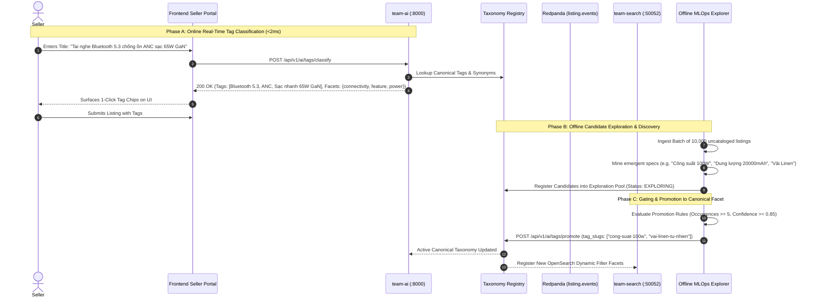

# Agora MLOps — Product Tag Classifier & Taxonomy Filter Enrichment

A production-grade, two-stage machine learning system that accelerates seller listing creation with **1-click auto-tagging** and dynamically enriches the marketplace search filter system with **canonical facets** via an offline exploration and promotion gating pipeline.

---

## 1. Executive Summary & Problem Statement

In an e-commerce marketplace (Shopee / Amazon scale), two critical friction points occur:
1. **Seller Listing Friction:** Sellers manually type product titles and descriptions but frequently omit standardized technical specifications, materials, and feature tags (e.g. *Bluetooth 5.3*, *Inverter*, *Inox 304*, *UPF50+*), leading to sparse catalog metadata.
2. **Search Discoverability & Conversion Loss:** Buyers rely heavily on granular faceted filters (`filter.connectivity=bluetooth-5-3`, `filter.material=cotton-100`, `filter.feature=anc`). If listings lack standardized tags, search recall drops and filter aggregations become ineffective.

To solve this without manual taxonomy overhead, Agora implements a **Two-Stage Tag Lifecycle (Explore $\rightarrow$ Promote)**:
- **Offline Exploration (`explore`):** Mines uncataloged listings, customer search queries, and unstructured descriptions to discover emergent candidate tags and cluster them into candidate facet groups.
- **Promotion Gating (`promote`):** Evaluates candidate quality metrics (frequency support, confidence score, category coherence, and synonym mapping) to promote candidates into **Official Canonical Labels**.
- **Online Fast Inference (`classify`):** Real-time sub-millisecond classification predicting canonical tags and structured OpenSearch facet filters as the seller types in the listing portal.

---

## 2. System Architecture Diagram

```mermaid
flowchart TD
  subgraph Seller_Flow["1. Seller Listing Creation (Online Path)"]
    Seller["Seller in Storefront / Cockpit"]
    ListingForm["Listing Creation Form (Title + Description)"]
    ClassifyAPI["POST /api/v1/ai/tags/classify<br/>(team-ai :8000 / team-gateway :8080)"]
    TagClassifier["TagClassifierService<br/>• Accent Normalization & N-Gram Matcher<br/>• Synonym Graph Lookup<br/>• Canonical Filter Mapper"]
    AutoTags["1-Click Suggested Tags & Facet Values"]
  end

  subgraph Search_Enrichment["2. Search Index & Dynamic Faceting"]
    DomainSvc["team-domain (:50051)<br/>Persists Listing + Tag IDs"]
    Outbox["Transactional Outbox<br/>Kafka: listing.events"]
    SearchIndexer["team-search (:50052)<br/>OpenSearch 2.11 Indexer"]
    OpenSearch[("OpenSearch<br/>listings_v1 Index<br/>• Keyword Facets<br/>• Dynamic Aggregations")]
    Buyer["Buyer Search & Filter Navigation"]
  end

  subgraph MLOps_Lifecycle["3. Offline Discovery & Promotion Pipeline"]
    CatalogLakehouse[("DuckDB / Parquet Lakehouse<br/>data/analytics/*.parquet")]
    ExploreJob["Offline Exploration Pipeline<br/>• Pattern & Spec Mining (Watt, mAh, Material)<br/>• Semantic Clustering & Frequency Analysis"]
    CandidatePool[("Candidate Tags Exploration Pool<br/>Status: EXPLORING")]
    PromotionGate["Promotion & Canonicalization Gate<br/>• Threshold: Frequency >= N, Confidence >= theta<br/>• Semantic Deduplication & Synonym Binding"]
    CanonicalTaxonomy[("Canonical Filter Facet Registry<br/>Status: PROMOTED")]
  end

  %% Online Inference Connections
  Seller --> ListingForm
  ListingForm -->|Fast Latency < 2ms| ClassifyAPI
  ClassifyAPI --> TagClassifier
  TagClassifier -->|Top-K Promoted Tags + Facets| AutoTags
  AutoTags -->|Seller Approves with 1-Click| DomainSvc
  DomainSvc --> Outbox
  Outbox --> SearchIndexer
  SearchIndexer --> OpenSearch
  Buyer -->|Faceted Queries (e.g. filter.connectivity=bluetooth-5-3)| OpenSearch

  %% Offline Exploration Connections
  CatalogLakehouse --> ExploreJob
  ExploreJob --> CandidatePool
  CandidatePool --> PromotionGate
  PromotionGate -->|Promote to Canonical Facet| CanonicalTaxonomy
  CanonicalTaxonomy -.->|Dynamic Registry Sync| TagClassifier
  CanonicalTaxonomy -.->|Dynamic Facet Mapping Update| SearchIndexer
```

---

## 3. Two-Stage Tag Lifecycle & Workflow



---

## 4. Mathematical Formulation & Gating Thresholds

### 1. Tag Extraction Confidence Scoring
Given an input listing $L$ with normalized text $T_L = \text{Norm}(\text{Title} \oplus \text{Description})$, the confidence score $S(t, L)$ for a candidate tag $t$ belonging to category $C_t$ is computed as:

$$S(t, L) = \left( \alpha \cdot \mathbb{I}_{\text{Exact}}(t, T_L) + (1-\alpha) \cdot \max_{s \in \text{Syn}(t)} \text{Sim}(s, T_L) \right) \cdot \gamma(C_t, C_L)$$

Where:
- $\mathbb{I}_{\text{Exact}}(t, T_L) \in \{0, 1\}$ indicates exact token/regex boundary match.
- $\text{Sim}(s, T_L)$ is the maximum semantic similarity against registered synonyms $\text{Syn}(t)$.
- $\alpha = 0.85$ prioritizes high-precision exact n-gram matching.
- $\gamma(C_t, C_L)$ is the category prior: $\gamma = 1.0$ when category matches or $C_t = \text{"all"}$, and $\gamma = 0.60$ for cross-category priors.

### 2. Promotion Gating Criterion
A candidate tag $t \in \mathcal{T}_{\text{exploring}}$ is eligible for automated promotion to Canonical Facet $\mathcal{T}_{\text{promoted}}$ if and only if:

$$\text{Eligible}(t) = \begin{cases} 
1 & \text{if } \text{Freq}(t) \ge N_{\min} \land \overline{S}(t) \ge \theta_{\text{conf}} \land \text{Entropy}(C_t) \le H_{\max} \\
0 & \text{otherwise}
\end{cases}$$

Where default production thresholds are set to:
- $N_{\min} = 5$ (Minimum catalog occurrence support).
- $\theta_{\text{conf}} = 0.80$ (Minimum average extraction confidence).
- $\text{Entropy}(C_t) \le 0.5$ (Category coherence filter ensuring the tag is not noisy cross-domain spam).

---

## 5. API Specification

### 1. Classify Product Tags (Online Fast Inference)
`POST /api/v1/ai/tags/classify`

**Request:**
```json
{
  "title": "Tai nghe Bluetooth 5.3 chống ồn chủ động ANC sạc nhanh 65W GaN",
  "description": "Chuẩn chống nước IPX7 pin 50h chuyên gaming",
  "category_id": "cat-electronics",
  "top_k": 8,
  "include_candidates": true
}
```

**Response (`200 OK` in < 2ms):**
```json
{
  "canonical_tags": [
    {
      "tag_id": "tag-bt-53",
      "name": "Bluetooth 5.3",
      "slug": "bluetooth-5-3",
      "facet_group": "connectivity",
      "category_id": "cat-electronics",
      "status": "promoted",
      "confidence": 1.0,
      "is_canonical": true
    },
    {
      "tag_id": "tag-anc",
      "name": "Chống ồn chủ động (ANC)",
      "slug": "chong-on-chu-dong-anc",
      "facet_group": "feature",
      "category_id": "cat-electronics",
      "status": "promoted",
      "confidence": 1.0,
      "is_canonical": true
    }
  ],
  "candidate_tags": [],
  "suggested_facet_filters": {
    "connectivity": ["bluetooth-5-3"],
    "feature": ["chong-on-chu-dong-anc", "chong-nuoc-ipx7"],
    "power": ["sac-nhanh-65w-gan"],
    "usage": ["chuyen-gaming"]
  },
  "category_id": "cat-electronics",
  "execution_time_ms": 0.85
}
```

### 2. Explore Candidate Tags (Offline Batch Discovery)
`POST /api/v1/ai/tags/explore`

Processes a batch of raw product listings, extracts emergent specs/patterns, clusters keyword frequencies, and registers candidates in the exploration pool.

### 3. Promote Candidate Tags (Gating & Canonicalization)
`POST /api/v1/ai/tags/promote`

**Request:**
```json
{
  "tag_slugs": ["cong-suat-100w", "dung-luong-20000mah", "vai-linen-tu-nhien"],
  "target_category_id": "cat-electronics",
  "add_synonyms": ["sac 100w", "pin 20000mah", "chat lieu linen"]
}
```

---

## 6. Running the Tag Pipeline CLI Tool

The pipeline includes a standalone, fully functional CLI tool to verify online inference, offline exploration, and promotion gating:

```bash
# Execute the full 4-phase lifecycle demo
python3 platform-core/tools/tag_taxonomy_pipeline.py
```

### Running Unit & API Tests
```bash
# Execute Pytest test suites
python3 -m pytest team-ai/tests/unit/modules/test_tag_classifier*.py -v
```
