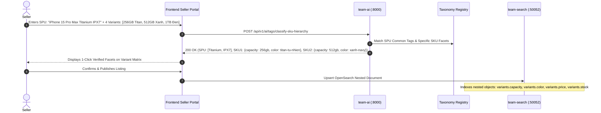

# Agora MLOps — Product & Granular SKU Tag Classifier & Filter Taxonomy Enrichment

A production-grade, two-stage machine learning system that accelerates seller listing creation with **1-click auto-tagging** and dynamically enriches the marketplace search filter system with **canonical facets** scaling across **SPU (Parent Listing) and Child SKU (Variant)** levels.

---

## 1. Executive Summary & Problem Statement

In an e-commerce marketplace (Shopee / Amazon scale), products have multi-tiered hierarchies:
1. **SPU Level (Standard Product Unit / Parent Listing):** Brand, general category, high-level features (*Khung Titanium, Chống nước IPX7, Sạc nhanh 65W GaN, Chống ồn ANC*).
2. **SKU Level (Stock Keeping Unit / Child Variants):** Color (*Titan Tự Nhiên, Xanh Navy, Đen Nhám*), Storage Capacity (*128GB, 256GB, 512GB, 1TB*), Apparel Sizes (*S, M, L, XL*), Power/Wattage variants, and edition bundles (*Bản tiêu chuẩn, Combo phụ kiện*).

### The SKU-Level Scaling Challenge
- If filtering is only performed at the SPU level, a buyer searching for `filter.capacity=512gb` might land on a product where only the 128GB variant is in stock, or where the price displayed doesn't reflect the 512GB SKU.
- Agora solves this by implementing **Hierarchical SPU $\rightarrow$ Granular SKU Classification**:
  - Inherits common parent SPU tags into all child variants: $\mathcal{T}(\text{SKU}_i) = \mathcal{T}(\text{SPU}) \cup \mathcal{T}_{\text{specific}}(\text{SKU}_i)$.
  - Extracts exact variant dimensions (`color`, `capacity`, `size`, `power`, `material`) per SKU.
  - Formulates ready-to-index **OpenSearch 2.11 Nested Documents** enabling exact variant queries (`variants.capacity=512gb AND variants.stock > 0`) without cross-variant false positives.

---

## 2. System Architecture Diagram

```mermaid
flowchart TD
  subgraph Seller_Flow["1. Seller Listing & SKU Creation (Online Path)"]
    Seller["Seller in Storefront / Cockpit"]
    ListingForm["Listing & Variant Matrix Form (Parent + N SKUs)"]
    ClassifyAPI["POST /api/v1/ai/tags/classify-sku-hierarchy<br/>(team-ai :8000 / team-gateway :8080)"]
    TagClassifier["TagClassifierService<br/>• SPU Feature Extractor<br/>• Granular SKU Variant Matcher<br/>• Tag Inheritance Resolver"]
    AutoTags["SPU Common Tags + Granular SKU Facets"]
  end

  subgraph Search_Enrichment["2. OpenSearch 2.11 Nested Indexing & Faceting"]
    DomainSvc["team-domain (:50051)<br/>Persists Listing + Variants + Facets"]
    Outbox["Transactional Outbox<br/>Kafka: listing.events"]
    SearchIndexer["team-search (:50052)<br/>OpenSearch 2.11 Nested Indexer"]
    OpenSearch[("OpenSearch<br/>listings_v1 Index<br/>• Root Facets (brand, spu_tags)<br/>• Nested Variant Facets (color, size, storage)")]
    Buyer["Buyer Search & Precise SKU Filter"]
  end

  subgraph MLOps_Lifecycle["3. Offline Exploration & Promotion Gating"]
    CatalogLakehouse[("DuckDB / Parquet Lakehouse<br/>data/analytics/*.parquet")]
    ExploreJob["Offline Exploration Pipeline<br/>• SPU & SKU Pattern Mining<br/>• Spec Clustering (Watt, mAh, Storage, Material)"]
    CandidatePool[("Candidate Tags Exploration Pool<br/>Status: EXPLORING")]
    PromotionGate["Promotion & Canonicalization Gate<br/>• Threshold: Frequency >= N, Confidence >= theta<br/>• Synonym Binding & Facet Grouping"]
    CanonicalTaxonomy[("Canonical Facet Registry<br/>Status: PROMOTED")]
  end

  %% Online Inference Connections
  Seller --> ListingForm
  ListingForm -->|Vectorized Batch Latency < 5ms| ClassifyAPI
  ClassifyAPI --> TagClassifier
  TagClassifier -->|SPU Tags + Per-SKU Facet Map| AutoTags
  AutoTags -->|Seller Approves with 1-Click| DomainSvc
  DomainSvc --> Outbox
  Outbox --> SearchIndexer
  SearchIndexer --> OpenSearch
  Buyer -->|Nested Queries (e.g. variants.capacity=512gb & variants.stock>0)| OpenSearch

  %% Offline Exploration Connections
  CatalogLakehouse --> ExploreJob
  ExploreJob --> CandidatePool
  CandidatePool --> PromotionGate
  PromotionGate -->|Promote to Canonical Facet| CanonicalTaxonomy
  CanonicalTaxonomy -.->|Dynamic Registry Sync| TagClassifier
  CanonicalTaxonomy -.->|Dynamic Facet Mapping Update| SearchIndexer
```

---

## 3. Hierarchical SKU Classification & Inheritance Flow



---

## 4. OpenSearch 2.11 Nested Mapping Definition

To guarantee that filtering for `capacity=512gb` and `price <= 35000000` matches the **exact same SKU variant**, the OpenSearch index is configured with `nested` variant mapping:

```json
{
  "mappings": {
    "properties": {
      "listing_id": { "type": "keyword" },
      "title": { "type": "text", "analyzer": "vietnamese_standard" },
      "category_id": { "type": "keyword" },
      "price_min": { "type": "long" },
      "price_max": { "type": "long" },
      "total_stock": { "type": "integer" },
      "is_in_stock": { "type": "boolean" },
      "spu_tags": { "type": "keyword" },
      "spu_facets": {
        "properties": {
          "feature": { "type": "keyword" },
          "connectivity": { "type": "keyword" },
          "material": { "type": "keyword" },
          "power": { "type": "keyword" },
          "capacity": { "type": "keyword" },
          "color": { "type": "keyword" },
          "size": { "type": "keyword" }
        }
      },
      "variants": {
        "type": "nested",
        "properties": {
          "variant_id": { "type": "keyword" },
          "sku_code": { "type": "keyword" },
          "name": { "type": "text" },
          "price": { "type": "long" },
          "stock": { "type": "integer" },
          "is_in_stock": { "type": "boolean" },
          "facets": {
            "properties": {
              "capacity": { "type": "keyword" },
              "color": { "type": "keyword" },
              "size": { "type": "keyword" },
              "power": { "type": "keyword" },
              "ram": { "type": "keyword" }
            }
          },
          "tags": { "type": "keyword" }
        }
      }
    }
  }
}
```

---

## 5. API Specification

### 1. Hierarchical SPU & SKU Classification
`POST /api/v1/ai/tags/classify-sku-hierarchy`

**Request:**
```json
{
  "spu_title": "Điện thoại Apple iPhone 15 Pro Max Khung Titanium Chống nước IPX7",
  "spu_description": "Camera tiềm vọng 5x chip A17 Pro mạnh mẽ chuyên gaming",
  "category_id": "cat-electronics",
  "variants": [
    {
      "variant_id": "sku-101",
      "name": "Titan Tự Nhiên / 256GB",
      "sku_code": "IP15PM-NAT-256",
      "price": 29990000,
      "stock": 20,
      "options": { "color": "Titan Tự Nhiên", "capacity": "256GB" }
    },
    {
      "variant_id": "sku-102",
      "name": "Xanh Navy / 512GB",
      "sku_code": "IP15PM-BLU-512",
      "price": 34990000,
      "stock": 12,
      "options": { "color": "Xanh Navy", "capacity": "512GB" }
    }
  ]
}
```

**Response (`200 OK` in < 3ms):**
```json
{
  "spu_title": "Điện thoại Apple iPhone 15 Pro Max Khung Titanium Chống nước IPX7",
  "category_id": "cat-electronics",
  "spu_canonical_tags": [
    { "slug": "chong-nuoc-ipx7", "name": "Chống nước IPX7", "facet_group": "feature" },
    { "slug": "chuyen-gaming", "name": "Chuyên Gaming", "facet_group": "usage" }
  ],
  "sku_results": [
    {
      "variant_id": "sku-101",
      "sku_code": "IP15PM-NAT-256",
      "name": "Titan Tự Nhiên / 256GB",
      "price": 29990000,
      "stock": 20,
      "is_in_stock": true,
      "variant_facets": {
        "capacity": "256gb",
        "color": "titan-tu-nhien"
      },
      "all_effective_tags": [
        { "slug": "chong-nuoc-ipx7" },
        { "slug": "chuyen-gaming" },
        { "slug": "256gb" },
        { "slug": "titan-tu-nhien" }
      ]
    }
  ],
  "spu_facet_filters": {
    "feature": ["chong-nuoc-ipx7"],
    "usage": ["chuyen-gaming"],
    "capacity": ["256gb", "512gb"],
    "color": ["titan-tu-nhien", "xanh-navy"]
  },
  "total_skus_processed": 2,
  "execution_time_ms": 2.15
}
```

---

## 6. Running the Demo & Test Suites

```bash
# Run the end-to-end 4-phase pipeline (including SKU hierarchy & OpenSearch nested payload generation)
python3 platform-core/tools/tag_taxonomy_pipeline.py

# Run unit & API test suites
python3 -m pytest team-ai/tests/unit/modules/test_tag_classifier*.py -v
```
