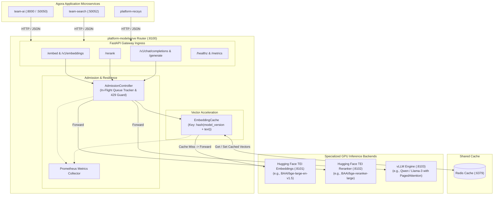

# platform-modelserve — Unified ML Serving Router & Inference Gateway

`platform-modelserve` is Agora's internal **Machine Learning Inference Gateway & Model Serving Router** (ADR-0011). Built on **Python 3.12 / FastAPI** and listening on port `:8100`, it provides a unified, resilient, high-throughput abstraction layer over specialized open-source inference runtimes—including **Hugging Face Text Embeddings Inference (TEI)** and **vLLM**.

---

## 1. System Design & Architecture Overview

Rather than having application microservices (`team-ai`, `team-search`, `platform-recsys`) integrate directly with diverse GPU runtime endpoints, `platform-modelserve` serves as a centralized gateway providing:
- **Contract Adaptation**: Bridges varied backend APIs into unified endpoints, supporting both Agora-native formats (`/embed`, `/rerank`, `/generate`) and OpenAI-compatible specifications (`/v1/embeddings`, `/v1/chat/completions`).
- **Distributed Embedding Cache**: Avoids redundant neural computations by caching text embeddings in Redis, keyed deterministically by `hash(model_version + text)`.
- **Adaptive Concurrency & Backpressure**: Implements queue-depth admission control to protect underlying GPU engines from saturation, responding with `HTTP 429 Too Many Requests` and `Retry-After` headers during peak loads.
- **Enterprise Observability**: Tracks in-flight queue depth, cache hit/miss ratios, and per-endpoint latency distributions via Prometheus metrics (`/metrics`).

---

## 2. Tech Stack

- **Gateway Engine**: Python 3.12, FastAPI, Uvicorn, AsyncIO, HTTPX (asynchronous connection pooling)
- **Specialized Inference Backends**:
  - **Hugging Face TEI Embeddings (`:8101`)**: High-throughput vector representation inference
  - **Hugging Face TEI Reranker (`:8102`)**: Cross-encoder scoring for 2nd-stage candidate ranking
  - **vLLM (`:8103`)**: High-throughput LLM text generation with PagedAttention and continuous batching
- **Caching & Resilience**: Redis (vector caching), AsyncIO concurrency locks, Adaptive Admission Controller
- **Observability**: Prometheus client metrics (`/metrics`), OpenTelemetry tracing, standard logging

---

## 3. Architecture Diagram



---

## 4. Internal Architecture & Data Flow

### A. Unified Ingress Endpoints & Ports

| Endpoint | Upstream Backend | Target Port | Description |
|---|---|---|---|
| `POST /embed` / `POST /v1/embeddings` | Hugging Face TEI Embed | `:8101` | Generates dense vector embeddings. Checks Redis cache first; queries TEI only for cache-miss texts. |
| `POST /rerank` | Hugging Face TEI Rerank | `:8102` | Cross-encoder relevance scoring between a query and multiple candidate text snippets. |
| `POST /v1/chat/completions` / `POST /generate` | vLLM Engine | `:8103` | Proxies streaming or complete chat and text generation payloads. |
| `GET /healthz` | Local | `:8100` | Liveness and readiness health probe. |
| `GET /metrics` | Local | `:8100` | Exposes Prometheus runtime metrics. |

### B. Embedding Cache Flow (`modelserve/cache.py`)
1. Ingests a batch of texts $[T_1, T_2, \dots, T_N]$ under active `model_version`.
2. Computes deterministic SHA-256 cache keys:
   $$\text{Key}_i = \text{prefix} : \text{model\_version} : \text{SHA256}(T_i)$$
3. Performs a pipelined `MGET` query against Redis (`:6379`).
4. Dispatches only cache-miss texts to upstream TEI (`:8101`).
5. Asynchronously writes newly computed vectors to Redis with configurable TTL (`embedding_cache_ttl_seconds`, default 7 days).
6. Reconstructs and returns the full vector batch preserving the original input ordering.

### C. Admission Control & Backpressure (`modelserve/admission.py`)
- Tracks instantaneous concurrent inference requests (`in_flight_requests`) per endpoint.
- If in-flight requests exceed `MAX_QUEUE_DEPTH` (default 100):
  - Increments `modelserve_admission_rejections_total`.
  - Immediately rejects the request with `HTTP 429 Too Many Requests` and headers `{"Retry-After": "2"}` to protect GPU inference engines from cascading failure.

### D. Prometheus Observability Metrics
- `modelserve_in_flight_requests` (Gauge): Current concurrent requests by endpoint.
- `modelserve_admission_rejections_total` (Counter): Cumulative count of rejected requests due to queue saturation.
- `modelserve_request_duration_seconds` (Histogram): Latency percentiles partitioned by endpoint and status code.
- `modelserve_cache_hits_total` / `modelserve_cache_misses_total` (Counters): Efficiency metrics for the vector cache.

---

## 5. Directory Structure

```text
modelserve/
  __init__.py
  __main__.py                  # CLI entrypoint
  admission.py                 # In-flight request concurrency & Prometheus metrics
  cache.py                     # Redis embedding cache implementation
  config.py                    # Reflection settings and .env loader
  model_version.py             # Model generation version resolver
  router.py                    # FastAPI application & endpoint routing
  server.py                    # Uvicorn server launcher
tests/
  test_admission.py            # Concurrency limit and 429 rejection tests
  test_cache.py                # Redis cache hit/miss and key hashing tests
  test_config.py               # Environment parsing tests
  test_contract_conformance.py # OpenAI and native format conformance tests
  test_env_drift.py            # .env.example parity gate
  test_router.py               # End-to-end routing and mock backend tests
```

---

## 6. Local Setup & Testing

```bash
# 1. Bring up Redis infra from platform-core
cd ../platform-core/infra && docker compose up -d redis

# 2. Install dependencies with uv
cd ../platform-modelserve
uv sync --dev

# 3. Run test suite
make test

# 4. Start local router server
make run
# Access Swagger docs: http://localhost:8100/docs
# Prometheus metrics: http://localhost:8100/metrics
```
