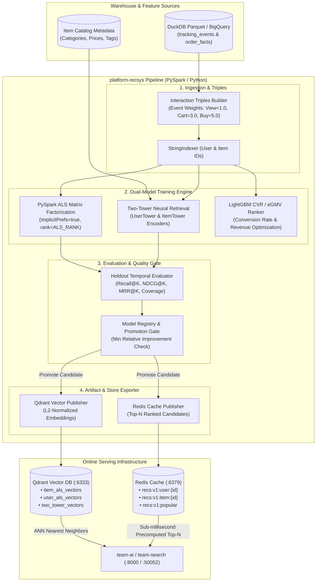

# platform-recsys — Offline Recommendation & Candidate Retrieval Engine

`platform-recsys` is the offline **recommendation training, evaluation, and candidate vector indexing engine** in the Agora MLOps ecosystem. It processes behavioral lakehouse telemetry from `team-analytics`, trains latent factor collaborative filtering (PySpark MLlib ALS) and deep Two-Tower neural retrieval models, gates candidate models through automated offline evaluation criteria, and publishes production vector embeddings and precomputed Top-N rankings to **Qdrant** (`:6333`) and **Redis** (`:6379`).

---

## 1. System Design & Architecture Overview

`platform-recsys` powers the candidate generation and scoring stages of Agora's multi-stage recommendation funnel:
- **Offline Batch Processing**: Executes scheduled batch pipelines (via GitOps CronJobs / ArgoCD) using PySpark over historical interaction triples $(u, i, w)$.
- **Multi-Model Retrieval**:
  - **Implicit ALS Matrix Factorization**: Learns low-dimensional latent embeddings for users and items from implicit interaction events (impressions, clicks, add-to-carts, orders).
  - **Two-Tower Neural Retrieval**: Employs dual deep neural encoders (User Tower & Item Tower) to project user features and item catalog metadata into a unified dense space, ensuring high-recall retrieval even for cold items.
- **Automated Promotion Gate**: Validates candidate models on holdout sets using ranking metrics (Recall@K, NDCG@K, MRR@K, Catalog Coverage) before publishing to production stores.
- **Low-Latency Artifact Stores**: Publishes L2-normalized vector points into Qdrant for real-time ANN similarity search, and populates Redis with precomputed Top-N recommendations.

---

## 2. Tech Stack

- **Data Processing & ML Engine**: Python 3.12, Apache Spark / PySpark MLlib (Local mode / Cluster mode), NumPy, Pandas
- **Algorithms & Architectures**:
  - **Collaborative Filtering**: Alternating Least Squares (`implicitPrefs=True`)
  - **Deep Retrieval**: Two-Tower Neural Encoders (User Tower & Item Tower cosine projections)
  - **2nd-Stage Reranking**: LightGBM / CVR Model ($eGMV = pCTR \cdot pCVR^\beta \cdot Price^\gamma$)
- **Storage & Vector Infrastructure**:
  - **Warehouse Source**: Columnar Parquet / DuckDB / Google Cloud BigQuery
  - **Vector Database**: Qdrant (`:6333`) for dense ANN cosine search
  - **Online Cache**: Redis (`:6379`) for precomputed Top-N candidate lists and popularity fallback
- **MLOps & Quality Gate**: Temporal holdout evaluation, Redis-backed Model Registry, PSI Data/Concept Drift Monitoring

---

## 3. Architecture Diagram



---

## 4. Internal Architecture & Data Flow

### A. Offline Training & Implicit Feedback Triples
1. **Interaction Ingestion**: Extracts raw user behavioral events (`view`, `favorite`, `add_to_cart`, `purchase`) from the analytics warehouse.
2. **Weight Assignment**: Converts event actions into implicit feedback weights using configurable multipliers (e.g., `view: 1.0`, `favorite: 2.0`, `add_to_cart: 3.0`, `purchase: 5.0`).
3. **PySpark ALS Fit**: Maps non-contiguous user IDs and listing IDs into dense indices via `StringIndexer`. Fits an ALS model with `implicitPrefs=true`, latent rank `ALS_RANK`, regularization parameter `ALS_REG_PARAM`, and confidence coefficient `ALS_ALPHA`.
4. **L2-Normalized Latent Factors**: Extracts $U \in \mathbb{R}^{M \times d}$ and $V \in \mathbb{R}^{N \times d}$ factor matrices and normalizes them onto the unit hypersphere:
   $$\mathbf{v}_{\text{norm}} = \frac{\mathbf{v}}{\|\mathbf{v}\|_2}$$

### B. Two-Tower Deep Neural Retrieval
For full-catalog coverage and cold-start generalization:
- **User Tower**: Encodes historical category interactions, demographic preferences, and user context.
- **Item Tower**: Projects item attributes (category taxonomy, normalized price, historical popularity, metadata embeddings) into the same $d$-dimensional embedding space.
- **ANN Retrieval**: Evaluates similarity as dot-product / cosine angle:
   $$\text{score}(u, i) = \langle \mathbf{e}_{\text{user}}(u), \mathbf{e}_{\text{item}}(i) \rangle$$

### C. Evaluation & Promotion Gate
Before updating production serving systems, candidate models must clear the automated promotion gate:
1. **Temporal Holdout Validation**: Evaluates predictions on the latest interaction timestamp split.
2. **Key Metrics**: Computes Recall@K, NDCG@K, MRR@K, and Catalog Coverage ratio.
3. **Promotion Policy**: Compares candidate metrics against active production baseline. Promotion requires:
   $$\text{Metric}_{\text{candidate}} \ge \text{Metric}_{\text{baseline}} \times (1 + \delta_{\text{min}})$$
   and catalog coverage $\ge \text{Coverage}_{\text{min}}$.

### D. Candidate Indexing & Online Feature Store Integration
- **Qdrant Vector DB (`:6333`)**:
  - `item_als_vectors`: Item latent vectors tagged with `listing_id`, `model_version`, and `updated_at`.
  - `user_als_vectors`: User preference vectors.
  - Generational pruning automatically cleans stale vectors from older model iterations.
- **Redis Cache (`:6379`)**:
  - `recs:v1:user:{user_key}`: Precomputed Top-N candidate list for personalized home feed.
  - `recs:v1:item:{listing_id}`: Similar item recommendations for product detail pages.
  - `recs:v1:popular`: Fallback items for cold-start users.
  - Keys have a rolling TTL (`RECS_CACHE_TTL_SECONDS`, default 48h).
- **CVR & Expected GMV (eGMV) Reranker**:
  Online ranker combines click-through rate ($pCTR$) and conversion rate ($pCVR$) with item price:
  $$\text{eGMV} = pCTR \times (pCVR)^\beta \times \left(\frac{\text{Price}}{\text{Price}_{\text{ref}}}\right)^\gamma$$

---

## 5. Directory Structure

```text
recsys/
  config.py                    # Environment settings, defaults, and drift gate
  spark.py                     # SparkSession builder (local[*] / cluster)
  warehouse.py                 # Reader seam: Parquet local / BigQuery prod
  interactions.py              # Implicit triples builder & StringIndexer
  train.py                     # PySpark ALS model fitting
  recommend.py                 # Top-N user recommendations & item similarity (NumPy)
  evals/                       # Offline evaluation: temporal split, metrics (Recall, NDCG, MRR)
  registry/                    # Model registry metadata and promotion gating
  two_tower/                   # Deep retrieval: UserTower, ItemTower, and pipeline
  ranker/                      # Multi-task LightGBM CVR model & eGMV ranker
  monitoring/                  # Population Stability Index (PSI) drift monitoring
  nearline/                    # Nearline signal processors
  load/
    qdrant.py                  # Qdrant collection upsert & stale vector cleanup
    redis_cache.py             # Redis precomputed candidate cache publisher
```

---

## 6. Local Execution & Testing

```bash
# 1. Synthesize sample Parquet telemetry
make sample SAMPLE=./data/tracking_events.parquet

# 2. Run unit tests without Spark dependency
make test-host

# 3. Execute full pipeline in local Spark mode
make run-local SAMPLE=./data/tracking_events.parquet

# 4. Or execute via Docker against platform-core infrastructure
docker compose -f docker-compose.local.yaml run --rm recsys-train
```
