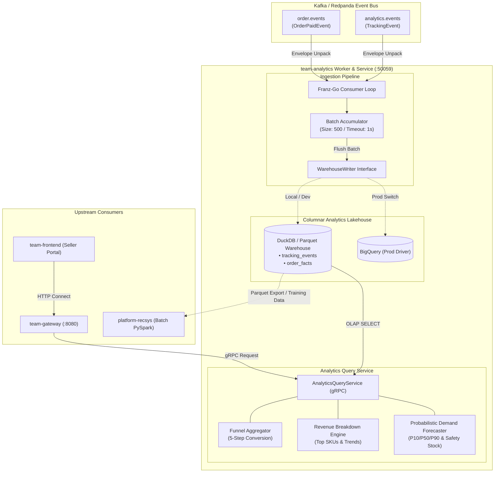

# team-analytics — Warehouse Writer & Analytics Query Service

A high-throughput **telemetry lakehouse writer and analytics query engine** bounded context (AGENTS.md §6c). It acts as the data foundation of Agora's MLOps and Business Intelligence pipeline: consuming behavioral clickstream and order transactions from Kafka/Redpanda, persisting columnar facts into an embedded DuckDB lakehouse (or BigQuery in production), and serving real-time seller funnels, revenue aggregations, and probabilistic demand forecasts over gRPC (`:50059`).

---

## 1. System Design & Architecture Overview

`team-analytics` bridges the asynchronous event streams of Agora with analytical processing. It operates as both a streaming worker and a query server:
- **Write Path (Streaming)**: Consumes raw events from Kafka topics (`analytics.events` and `order.events`), buffers and batches records, maps them into normalized relational structs, and persists them via the `WarehouseWriter` seam.
- **Read Path (gRPC :50059)**: Exposes `AnalyticsQueryService` to `team-gateway` and `team-frontend`, executing zero-copy OLAP aggregations across `tracking_events` and `order_facts`.

### Role in Agora MLOps & AI Ecosystem
1. **Behavioral Data Lake**: Ingests user interactions (`impression`, `view`, `add_to_cart`, `begin_checkout`, `purchase`) used downstream by `platform-recsys` for collaborative filtering and Two-Tower retrieval.
2. **Order Fact Warehouse**: Ingests transaction lines into `order_facts`, powering real-time seller dashboards and serving as the ground truth for revenue and conversion metrics.
3. **Probabilistic Demand Forecasting Engine**: Provides P10/P50/P90 quantile forecasts, lead-time demand estimates, dynamic safety stock, and inventory Reorder Points (ROP) to empower sellers with data-driven supply chain decisions.

---

## 2. Tech Stack

- **Core Engine & Transport**: Go 1.22, gRPC (`google.golang.org/grpc`), Protocol Buffers (`platform.analytics.v1`)
- **Streaming Consumer**: `github.com/twmb/franz-go` (Kafka/Redpanda high-performance client)
- **Columnar Lakehouse**:
  - **Local/CI/Test**: Embedded DuckDB (`github.com/marcboeker/go-duckdb`) with Parquet export
  - **Production**: Google Cloud BigQuery (partitioned & clustered streaming tables)
- **Observability & Diagnostics**: Structured logging (`log/slog`), Prometheus metrics, OpenTelemetry tracing, gRPC Health Checking Protocol

---

## 3. Architecture Diagram



---

## 4. Internal Architecture & Data Flow

### A. Kafka Telemetry & Order Ingestion Pipeline
1. **Event Types**:
   - `analytics.events`: Wraps `platform.analytics.v1.TrackingEvent` (user ID, session ID, listing ID, event type, timestamp, metadata). Supported events: `impression`, `view`, `add_to_cart`, `begin_checkout`, `purchase`.
   - `order.events`: Wraps `platform.order.v1.OrderPaidEvent`. The consumer decomposes order items into granular rows in `order_facts` (`order_id`, `seller_id`, `listing_id`, `variant_id`, `quantity`, `unit_price`, `occurred_at`).
2. **At-Least-Once Delivery**:
   - Events are buffered in memory up to `BATCH_MAX_SIZE` (default 500) or `BATCH_FLUSH_INTERVAL_SECONDS` (default 1s).
   - Kafka offsets are committed **strictly after** the batch is successfully persisted to DuckDB/BigQuery.
   - Envelopes carry a unique `event_id` enabling deduplication.

### B. Warehouse Driver Seam
Persistence is abstracted via `internal/warehouse.WarehouseWriter`:
- **DuckDB Driver (`internal/warehouse/duckdb`)**: Uses embedded DuckDB with CGO bindings. Offers high-speed vectorized OLAP queries directly on local Parquet files, ideal for local development, CI/e2e tests, and offline ML pipelines.
- **BigQuery Driver (`internal/warehouse/bigquery`)**: Enterprise-grade streaming ingestion into partitioned and clustered dataset tables for cloud deployment.
- **Fake Driver (`internal/warehouse/fake`)**: Thread-safe in-memory adapter for hermetic unit testing.

### C. 5-Step Conversion Funnel Analytics
The `GetSellerFunnel` RPC queries real-time conversion dynamics for any seller across an arbitrary time window $[t_{\text{from}}, t_{\text{to}}]$:
$$\text{Impression} \longrightarrow \text{View} \longrightarrow \text{Add to Cart} \longrightarrow \text{Begin Checkout} \longrightarrow \text{Purchase}$$
- Views and engagement counts are filtered from `tracking_events`.
- Unique completed purchase orders are scanned from `order_facts`.

### D. Probabilistic Demand Forecasting & Inventory Optimization
The `GetDemandForecast` RPC delivers probabilistic daily SKU forecasts over a configurable horizon (default 28 days) with automated safety stock and reorder point calculations:
1. **Quantile Projections**:
   - Computes empirical demand mean $\mu_{\text{daily}}$ and sample standard deviation $\sigma_{\text{daily}}$ from historical `order_facts` (with cold-start heuristic fallbacks).
   - Projects 3 quantile demand trajectories:
     - **P10 (Pessimistic / Lower Bound)**: $\max(0, \mu_{\text{daily}} - 1.28 \cdot \sigma_{\text{daily}})$
     - **P50 (Median Expected Demand)**: $\mu_{\text{daily}}$
     - **P90 (Optimistic / Peak Demand)**: $\mu_{\text{daily}} + 1.28 \cdot \sigma_{\text{daily}}$
2. **Safety Stock & Reorder Point (ROP)**:
   - Evaluates desired service level $\alpha \in \{0.90, 0.95, 0.99\}$ to determine standard normal inverse $z \in \{1.28, 1.65, 2.33\}$.
   - Calculates Lead Time Demand over $L$ days:
     $$\text{LeadDemand}_{\text{P50}} = \sum_{i=1}^{L} \text{P50}_i$$
   - Calculates Safety Stock ($SS$) and Reorder Point ($ROP$):
     $$SS = z \cdot \overline{\text{Spread}}_{[1..L]} \quad \text{where} \quad \overline{\text{Spread}} = \frac{1}{L} \sum_{i=1}^{L} (\text{P90}_i - \text{P50}_i)$$
     $$ROP = \text{LeadDemand}_{\text{P50}} + SS$$

---

## 5. Directory Structure

```
cmd/consumer/main.go            Worker entrypoint (gRPC health & query server + consumer loop)
internal/config                 Reflection-based env loader + .env.example drift gate
internal/observability          slog structured logging
internal/grpcserver             gRPC transport server (Health + AnalyticsQueryService)
internal/bootstrap              Lifecycle manager & WAREHOUSE_DRIVER adapter switch
internal/consumer               franz-go reader, envelope unmarshaler, batch accumulator
internal/warehouse              WarehouseWriter seam, schemas, and table definitions
internal/warehouse/duckdb       DuckDB columnar Parquet storage adapter
internal/warehouse/bigquery     BigQuery enterprise streaming adapter
internal/warehouse/fake         In-memory mock adapter for testing
internal/query                  Analytics query repository, duckdb SQL implementations & service
proto/                          Vendored platform contract (platform.analytics.v1)
```

---

## 6. Build, Run & Verification

```bash
# Generate protobuf code
make proto

# Run environment drift check, lint, and unit tests
make check

# Build Docker container (with DuckDB CGO bindings)
docker build -t team-analytics:latest .
```
