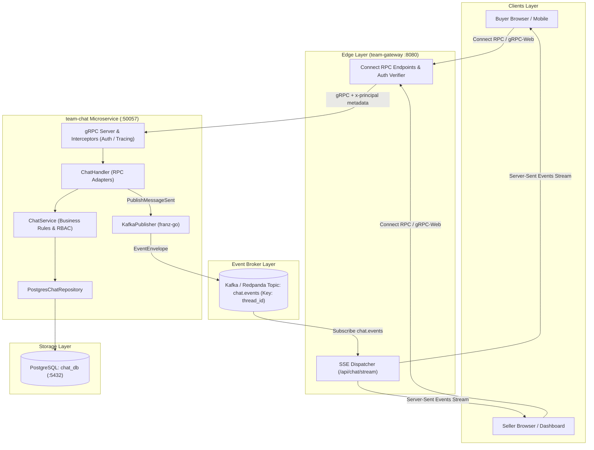
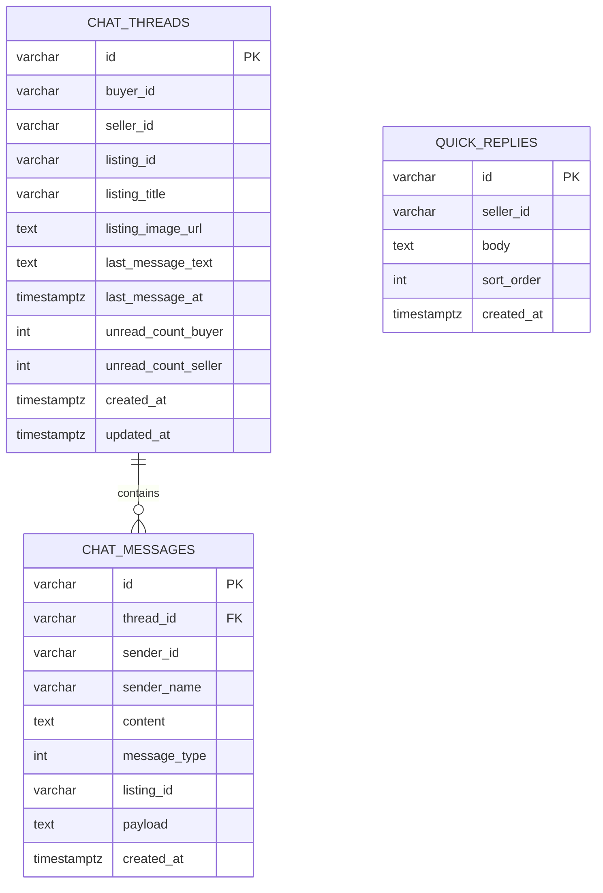
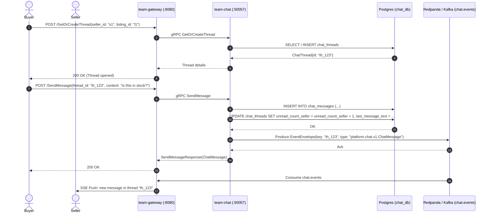
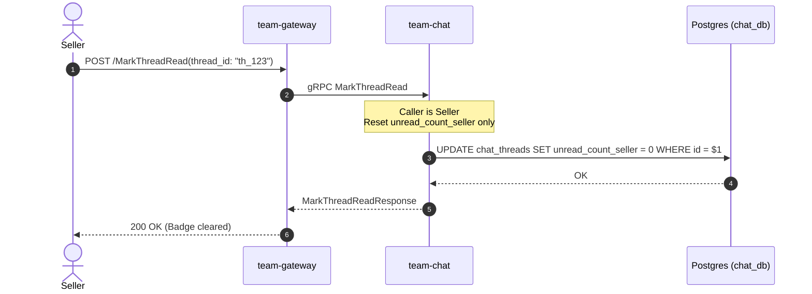
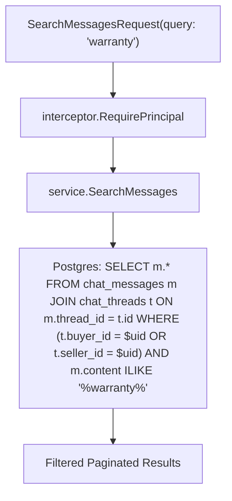

# team-chat — Buyer ↔ Seller 1:1 Messaging & Real-Time Event Streaming (Go)

The `team-chat` microservice provides high-concurrency, real-time 1:1 direct messaging between Buyers and Sellers across the Agora marketplace. It manages conversation threads bound to product listing contexts, coordinates unread badge counters, stores rich message payloads (listing cards, canned quick replies), performs participant-scoped message search, and emits event envelopes to Kafka/Redpanda for live Server-Sent Events (SSE) push streaming at the API Gateway.

The service strictly adheres to **Database-per-service (Rule 3)**, owning its dedicated `chat_db` PostgreSQL database, and exposes gRPC service `platform.chat.v1.ChatService` on port `:50057`.

---

## 1. Service Overview & Responsibilities

`team-chat` forms the direct communication lifeline between buyers and merchants. Key responsibilities include:

1. **Buyer-Seller Conversation Threads (`GetOrCreateThread`, `ListThreads`):**
   - Establishes and retrieves deterministic 1:1 threads identified by `(buyer_id, seller_id, listing_id)`.
   - Prevents self-chat loops (`buyer_id == seller_id`).
   - Retains contextual product metadata (listing title, thumbnail image URL) on the thread level.
2. **Rich Messaging Engine (`SendMessage`, `SendRichMessage`):**
   - Supports multiple message kinds: plain text (`MESSAGE_TYPE_TEXT`), interactive product cards (`MESSAGE_TYPE_LISTING_CARD`), and seller canned responses (`MESSAGE_TYPE_QUICK_REPLY`).
   - Validates caller participation: only buyers or sellers who are active participants in the thread can view or send messages.
3. **Independent Unread Badge Counters:**
   - Maintains isolated unread counts (`unread_count_buyer` and `unread_count_seller`) on each thread record.
   - Automatically increments the counter for the opposing party upon message ingress.
   - Clears only the caller's counter upon invoking `MarkThreadRead`.
4. **Event-Driven Streaming & Gateway SSE Push (ADR-0002):**
   - Emits `platform.chat.v1.ChatMessage` domain events wrapped inside `platform.events.v1.EventEnvelope` to Kafka topic `chat.events`.
   - Partitions messages by key = `thread_id` to guarantee strict causal per-thread ordering.
   - `team-gateway` consumes `chat.events` and pushes live updates to connected browsers via SSE.
5. **Participant-Scoped Message Search (`SearchMessages`):**
   - Full text / case-insensitive search across chat message contents restricted strictly to threads where the calling user participates.
6. **Seller Quick-Reply Templates (`ListQuickReplies`):**
   - Manages customizable canned reply templates configured by sellers for quick buyer assistance.

---

## 2. Technology Stack & Key Libraries

- **Language & Runtime:** Go 1.22 (Standard Library + pinned dependencies)
- **RPC Framework:** gRPC Go (`google.golang.org/grpc`), Protocol Buffers v2 (`google.golang.org/protobuf`), Buf CLI.
- **Database & Storage:** PostgreSQL 16 via `github.com/jackc/pgx/v5` (`pgxpool` connection pooling).
- **Event Streaming & Broker:** Kafka / Redpanda via `github.com/twmb/franz-go` (`kgo.Client`), zero producer linger for low latency delivery.
- **Authentication & Security:** Downstream metadata decoding (`x-principal-id`, `x-principal-scopes`) via `interceptor.RequirePrincipal`.
- **Distributed Tracing & Logs:** OpenTelemetry Go SDK (`go.opentelemetry.io/otel`), structured JSON logging with `log/slog`.
- **Testing:** Native Go `testing`, `testify`, ephemeral in-process gRPC test harnesses.

---

## 3. Detailed Architecture Diagram



---

## 4. Internal Package Structure & Data Schemas

### 4.1. Internal Package Structure

```
team-chat/
├── cmd/
│   └── server/
│       └── main.go                 # Service entrypoint, DB & Kafka initialization, graceful shutdown
├── generated/                      # Buf-generated proto stubs
│   └── platform/
│       ├── chat/v1/                # ChatService proto stubs & models
│       ├── common/v1/              # Common proto definitions (Principal, PageRequest, etc.)
│       └── events/v1/              # EventEnvelope proto stubs
├── internal/
│   ├── bootstrap/
│   │   └── resources.go            # Resource lifecycle management (pgxpool & Kafka client)
│   ├── config/
│   │   └── config.go               # Struct-tagged configuration from ENV variables
│   ├── events/
│   │   ├── publisher.go            # ChatPublisher interface, KafkaPublisher & NoopPublisher
│   │   └── publisher_test.go       # Kafka publisher unit & integration tests
│   ├── grpcserver/
│   │   ├── server.go               # gRPC server setup, listener creation & interceptor registration
│   │   └── server_test.go          # Ephemeral server startup test
│   ├── handler/
│   │   ├── chat.go                 # ChatServiceServer implementation & wire mappers
│   │   └── chat_test.go            # Comprehensive test suite (Auth, Self-Chat, Send, Kafka, Read)
│   ├── interceptor/
│   │   ├── auth.go                 # Principal extraction from incoming gRPC metadata
│   │   └── tracing.go              # OpenTelemetry trace context propagator
│   ├── observability/
│   │   └── tracer.go               # OpenTelemetry tracer provider helper
│   ├── repository/
│   │   ├── chat.go                 # ChatRepository interface, Postgres & In-Memory implementations
│   │   └── chat_test.go            # Database query & pagination unit tests
│   └── service/
│       ├── chat.go                 # Chat business logic, participant guards & validation
│       └── chat_test.go            # Business rules unit tests
└── migrations/
    ├── 0001_initial.up.sql         # chat_threads and chat_messages base tables
    └── 0002_rich_chat.up.sql       # Rich message columns & quick_replies table
```

### 4.2. Database Entity-Relationship Diagram



---

## 5. Core Workflows

### 5.1. Buyer-Seller Real-Time Chat Thread Creation & Message Flow

1. **Thread Discovery / Creation:** Buyer opens a listing and triggers `GetOrCreateThread(seller_id, listing_id)`. The system checks `uq_chat_threads_parties (buyer_id, seller_id, listing_id)` to return the existing thread or insert a new one atomically.
2. **Message Dispatch:** Sender calls `SendMessage` with content, optional rich type, and payload.
3. **Storage & Counter Update:** `team-chat` saves the message to `chat_messages`, updates `chat_threads.last_message_text`, `last_message_at`, and increments the recipient's unread counter (`unread_count_seller` if buyer sent, or `unread_count_buyer` if seller sent).
4. **Kafka Publishing:** An `EventEnvelope` containing the serialized `ChatMessage` is synchronously published to Kafka topic `chat.events` keyed by `thread_id`.
5. **Gateway Real-Time Fanout:** `team-gateway` consumes the event and dispatches it over active Server-Sent Event (SSE) streams to online clients.



### 5.2. Isolated Unread Badge Counters & Read Receipts

- When a recipient opens the thread, the client issues `MarkThreadRead(thread_id)`.
- The service inspects `Principal.id`:
  - If caller is `buyer_id`, it executes `UPDATE chat_threads SET unread_count_buyer = 0 WHERE id = $1`.
  - If caller is `seller_id`, it executes `UPDATE chat_threads SET unread_count_seller = 0 WHERE id = $1`.
- The other party's unread count remains untouched.



### 5.3. Participant-Scoped Message Search & Quick Replies

- **Search:** `SearchMessages(query, page)` executes a case-insensitive query matching `content ILIKE $query` joined with `chat_threads` to ensure the caller is either `buyer_id` or `seller_id`. Users can never search or inspect conversations outside their membership.
- **Quick Replies:** Sellers query `ListQuickReplies`. If customized templates exist in `quick_replies`, they are returned ordered by `sort_order ASC`; otherwise, standardized default templates are provided.



---

## 6. gRPC API Specification (`ChatService`)

Defined in package `platform.chat.v1`.

| RPC Method | Request Payload | Response Payload | Auth & Access Rule | Description |
|---|---|---|---|---|
| `GetOrCreateThread` | `seller_id`, `listing_id` | `thread` (ChatThread) | Authenticated | Gets or creates a 1:1 conversation thread for a product. Prevents self-chat. |
| `ListThreads` | `page` (PageRequest) | `threads` (repeated), `page` | Authenticated | Lists all threads where caller is buyer or seller, ordered by `updated_at DESC`. |
| `GetThreadMessages` | `thread_id`, `page` | `messages` (repeated), `page` | Participant Only | Returns chronological message history (`created_at ASC`) for the thread. |
| `SendMessage` | `thread_id`, `content`, `message_type`, `listing_id`, `payload` | `message` (ChatMessage) | Participant Only | Persists message, updates counters, and publishes `ChatMessage` event to Kafka. |
| `MarkThreadRead` | `thread_id` | `{}` | Participant Only | Resets the caller's specific unread counter to 0. |
| `SearchMessages` | `query`, `page` | `messages` (repeated), `page` | Authenticated | Participant-scoped text search across user's message history. |
| `ListQuickReplies` | `seller_id` | `quick_replies` (repeated string) | Authenticated | Lists seller's canned response templates or default presets. |
| `StreamChat` | `session_id`, `message` | `stream StreamChatResponse` | Optional / Open | Seed RPC for streaming conversational assistant tokens. |

---

## 7. Event-Driven Architecture & Kafka Specification

When `SendMessage` completes, an event is emitted:
- **Topic:** `chat.events` (configurable via `KAFKA_CHAT_TOPIC`)
- **Key:** `thread_id` (guarantees partition-level causal order)
- **Envelope:** `platform.events.v1.EventEnvelope`
  - `event_id`: Unique UUIDv4
  - `type`: `"platform.chat.v1.ChatMessage"`
  - `occurred_at`: Timestamp of message creation
  - `principal`: Forwarded sender identity
  - `request_id`: Distributed trace request identifier
  - `payload`: Protobuf binary serialization of `platform.chat.v1.ChatMessage`

---

## 8. Environment Variables

| Variable | Default | Description |
|---|---|---|
| `SERVER_HOST` | `0.0.0.0` | gRPC server listening host |
| `SERVER_PORT` | `50057` | gRPC server port |
| `SERVER_SHUTDOWN_GRACE_SECONDS` | `5.0` | Graceful shutdown drain timeout |
| `SERVER_REFLECTION_ENABLED` | `true` | Enable gRPC Server Reflection |
| `RUNTIME_LOG_LEVEL` | `info` | Structured logging level (`debug`, `info`, `warn`, `error`) |
| `RUNTIME_LOG_JSON` | `true` | Emit structured JSON log format |
| `POSTGRES_HOST` | `postgres-chat` | PostgreSQL host |
| `POSTGRES_PORT` | `5432` | PostgreSQL port |
| `POSTGRES_DB` | `chat_db` | Database name |
| `POSTGRES_USER` | `chat_svc` | Database user |
| `POSTGRES_PASSWORD` | `chat_pass` | Database password |
| `POSTGRES_SSLMODE` | `disable` | PostgreSQL SSL mode |
| `KAFKA_ENABLED` | `false` | Enable Kafka event publisher |
| `KAFKA_BROKERS` | `localhost:9092` | Kafka / Redpanda seed brokers |
| `KAFKA_CHAT_TOPIC` | `chat.events` | Kafka topic for chat message domain events |
| `OTEL_EXPORTER_OTLP_ENDPOINT` | `""` | OpenTelemetry collector endpoint |
| `OTEL_SERVICE_NAME` | `team-chat` | Distributed trace service name |

---

## 9. Local Setup & Testing

```bash
# 1. Start Postgres & Redpanda containers
docker compose -p platform-core up -d postgres-chat redpanda

# 2. Configure environment
cp .env.example .env

# 3. Run all unit and integration tests
go test -v -race ./...

# 4. Run service locally
go run cmd/server/main.go
```
