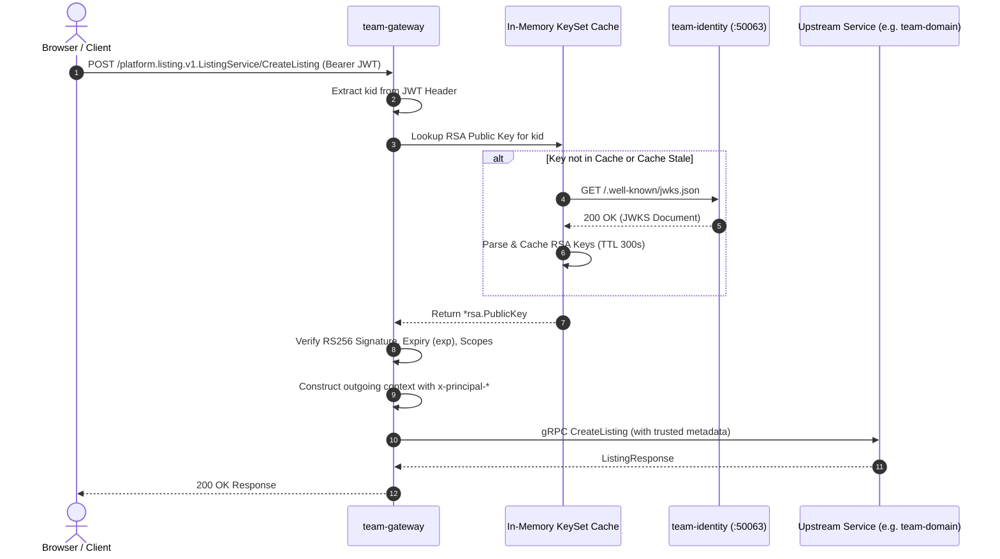

# team-gateway — Connect Edge & API Gateway

`team-gateway` is the single edge gateway and reverse proxy for the Agora Marketplace polyrepo platform. It exposes unified service contracts over **Connect RPC** (supporting HTTP/1.1 REST/JSON, gRPC-Web, and HTTP/2 cleartext `h2c` gRPC) on port `:8080`.

In strict adherence to **ARCHITECTURE Rules 1–3 and ADR-0003 / ADR-0006**:
- **Stateless & Logic-Free (Rules 1 & 2)**: The gateway holds **no database** and **no domain business logic**. It only routes, orchestrates timeouts/retries, enforces edge rate limiting, and attaches verified identity.
- **Single Verification Point (ADR-0006)**: The gateway is the sole edge verifier for **RS256 JWT** bearer tokens. It fetches and caches RSA public keys from `team-identity`'s JWKS endpoint (`/.well-known/jwks.json`) and translates verified JWT claims into trusted `x-principal-*` gRPC metadata headers.
- **Frontend & Client Boundary (Rule 1)**: All client traffic (Next.js Web Frontend SSR, mobile clients, external callers, E2E tests) enters the marketplace exclusively through `team-gateway` at `:8080`.

---

## 1. Service Overview & Core Responsibilities

```
+-----------------------------------------------------------------------------------+
|                                   team-gateway                                    |
|                                                                                   |
|  [Connect Protocol Mux]      [Edge Auth Resolution]       [Token Bucket Limiter]  |
|  - JSON over HTTP/1.1        - Verify RS256 via JWKS      - Per-user / per-IP     |
|  - gRPC-Web                  - Stamp x-principal-*        - TTL memory sweep      |
|  - HTTP/2 Cleartext (h2c)    - Anonymous default scopes   - 429 ResourceExhausted |
|                                                                                   |
|  [Edge Telemetry Collector]  [Real-Time Event Broker]     [Admin Cockpit HUD]     |
|  - POST /api/track           - GET /api/events/live       - GET /api/admin/metrics|
|  - Kafka: analytics.events   - SSE room multiplexing      - PromQL server query   |
+-----------------------------------------------------------------------------------+
```

### Core Responsibilities
1. **Multi-Protocol Edge Termination**: Serves 22 gRPC service contracts over Connect RPC, providing seamless JSON REST endpoints for browser fetch, gRPC-Web for client streaming, and native gRPC over HTTP/2.
2. **Asymmetric Edge Auth Verification**: Validates incoming RS256 Bearer JWTs against dynamic JWKS public keys without holding any private signing secret.
3. **Principal Identity Propagation**: Injects authenticated `x-principal-id`, `x-principal-type`, and `x-principal-scopes` into downstream gRPC outgoing context.
4. **Resilience & Rate Limiting**: Enforces token bucket rate limiting per user/IP, applies call deadlines (`CALL_TIMEOUT_SECONDS`), and retries idempotent read RPCs on `Unavailable` status.
5. **Telemetry Beacon Collector**: Ingests browser telemetry beacons (`POST /api/track`), attaches the caller's principal, and publishes `platform.analytics.v1.TrackingEvent` to Kafka `analytics.events`.
6. **Live SSE Multiplexing & Cockpit HUD**: Delivers real-time Server-Sent Events (`/api/events/live`) for chats/notifications and serves Prometheus metrics summary (`/api/admin/metrics`) for the Admin Cockpit.

---

## 2. Technology Stack & Key Libraries

| Component / Library | Version | Role & Description |
|---|---|---|
| **Go Runtime** | `1.22` | Core programming language runtime |
| **`connectrpc.com/connect`** | `v1.16.2` | Connect RPC framework handling gRPC, gRPC-Web, and JSON |
| **`connectrpc.com/grpcreflect`** | `v1.3.0` | gRPC Server Reflection protocol support (`v1` and `v1alpha`) |
| **`google.golang.org/grpc`** | `v1.66.0` | High-performance gRPC client connections to upstream services |
| **`google.golang.org/protobuf`** | `v1.34.2` | Protocol Buffers runtime and generated code structures |
| **`github.com/golang-jwt/jwt/v5`** | `v5.2.1` | RS256 JWT parsing and cryptographic signature validation |
| **`github.com/rs/cors`** | `v1.11.0` | Cross-Origin Resource Sharing (CORS) handler for web browsers |
| **`golang.org/x/time/rate`** | `v0.5.0` | In-memory token bucket rate limiting |
| **`golang.org/x/net/http2/h2c`** | `v0.26.0` | HTTP/2 Cleartext server wrapper |
| **`github.com/twmb/franz-go`** | `v1.18.0` | High-throughput Kafka producer for edge analytics telemetry |
| **`go.opentelemetry.io/otel`** | `v1.28.0` | OpenTelemetry distributed tracing and metrics provider |
| **`otelgrpc` (contrib)** | `v0.53.0` | Client stats handler for per-service gRPC RED metrics |

---

## 3. Detailed Architecture Diagram

```mermaid
flowchart TD
    Client["Clients (Browser / Next.js SSR / Mobile / E2E)"]
    
    subgraph Gateway ["team-gateway (:8080)"]
        H2C["h2c HTTP/2 Cleartext Handler + CORS"]
        
        subgraph Pipeline ["Edge Interceptor Pipeline"]
            ReqID["1. Request ID Interceptor (X-Request-Id)"]
            Auth["2. Auth Interceptor (RS256 Verify via JWKS)"]
            Log["3. Structured Logging (slog JSON)"]
            Limiter["4. Rate Limiter (Token Bucket per IP/User)"]
        end
        
        subgraph Forwarders ["Connect Forwarder Layer"]
            F_Auth["Auth & Identity Forwarder"]
            F_Listing["Listing & Search Forwarder"]
            F_Order["Cart & Order Forwarder"]
            F_Promo["Promotion & FlashSale Forwarder"]
            F_Other["AI, Chat, Payment, etc. Forwarders"]
        end
        
        subgraph EdgeEndpoints ["Specialized Edge Endpoints"]
            Track["POST /api/track (Telemetry Collector)"]
            SSE["GET /api/events/live (SSE Broker)"]
            Cockpit["GET /api/admin/metrics (PromQL HUD)"]
            Health["GET /healthz (Liveness Probe)"]
        end
        
        JWKSCache["JWKS Keyset Cache (TTL 300s + Lazy Force Refresh)"]
    end
    
    subgraph UpstreamServices ["Upstream Microservices (gRPC)"]
        S_Identity["team-identity (:50053)"]
        S_Listing["team-domain (:50051)"]
        S_Search["team-search (:50052)"]
        S_Engagement["team-engagement (:50054)"]
        S_Order["team-order (:50055)"]
        S_Payment["team-payment (:50056)"]
        S_Chat["team-chat (:50057)"]
        S_Notification["team-notification (:50058)"]
        S_Analytics["team-analytics (:50059)"]
        S_AI["team-ai (:50060)"]
        S_Promo["team-promotion (:50061)"]
        S_Referral["team-referral (:50062)"]
        S_Verification["team-verification (:50064)"]
        S_Sharing["team-sharing (:50065)"]
        S_Audit["team-audit (:50066)"]
    end

    subgraph AsyncInfra ["Infra & Brokers"]
        Kafka["Kafka / Redpanda (analytics.events)"]
        Prometheus["Prometheus Server (:9090)"]
        IdentityJWKS["team-identity HTTP (/.well-known/jwks.json :50063)"]
    end

    Client -->|HTTP / JSON / gRPC / Connect| H2C
    H2C --> ReqID
    ReqID --> Auth
    Auth --> Log
    Log --> Limiter
    Limiter --> Forwarders
    
    Auth -.->|Verify Kid| JWKSCache
    JWKSCache -.->|Fetch Public Keys| IdentityJWKS
    
    F_Auth -->|x-principal-*| S_Identity
    F_Listing -->|x-principal-*| S_Listing
    F_Listing -->|x-principal-*| S_Search
    F_Order -->|x-principal-*| S_Order
    F_Promo -->|x-principal-*| S_Promo
    F_Other -->|x-principal-*| S_Engagement
    F_Other -->|x-principal-*| S_Payment
    F_Other -->|x-principal-*| S_Chat
    F_Other -->|x-principal-*| S_Notification
    F_Other -->|x-principal-*| S_Analytics
    F_Other -->|x-principal-*| S_AI
    F_Other -->|x-principal-*| S_Referral
    F_Other -->|x-principal-*| S_Verification
    F_Other -->|x-principal-*| S_Sharing
    F_Other -->|x-principal-*| S_Audit
    
    H2C --> EdgeEndpoints
    Track -->|Publish TrackingEvent| Kafka
    Cockpit -->|Query Metrics| Prometheus
```



---

## 4. Internal Package Structure & Responsibilities

```
team-gateway/
├── cmd/gateway/
│   └── main.go              # Entrypoint: loads settings, dials gRPC, initializes edge & starts HTTP/h2c
├── internal/
│   ├── config/
│   │   ├── config.go        # Flat settings struct grouped by capability with reflection loader
│   │   └── envcheck.go      # Validates .env against .env.example drift at build/test time
│   ├── edge/
│   │   ├── server.go        # HTTP ServeMux assembling Connect handlers, reflection, /api/track & SSE
│   │   ├── interceptors.go  # Connect interceptor pipeline: request ID, auth, logging, rate limiter
│   │   ├── forward.go       # Edge helper: outgoing context with x-principal-*, callRead, callWrite
│   │   ├── collector.go     # Browser beacon telemetry ingestion (POST /api/track)
│   │   ├── cockpit.go       # Admin HUD metrics handler querying Prometheus PromQL
│   │   ├── realtime.go      # In-memory room-based Server-Sent Events broker
│   │   ├── auth.go          # Forwarder for platform.identity.v1.AuthService
│   │   ├── address.go       # Forwarder for platform.identity.v1.AddressService
│   │   ├── session.go       # Forwarder for platform.identity.v1.SessionService
│   │   ├── listing.go       # Forwarder for platform.listing.v1.ListingService
│   │   ├── search.go        # Forwarder for platform.search.v1.SearchService
│   │   ├── engagement.go    # Forwarder for platform.engagement.v1.EngagementService
│   │   ├── cart.go          # Forwarder for platform.order.v1.CartService
│   │   ├── order.go         # Forwarder for platform.order.v1.OrderService
│   │   ├── payment.go       # Forwarder for platform.payment.v1.PaymentService
│   │   ├── chat.go          # Forwarder for platform.chat.v1.ChatService (Buyer/Seller & AI)
│   │   ├── ai.go            # Forwarder for platform.ai.v1.AIService
│   │   ├── recommendation.go# Forwarder for platform.recommendation.v1.RecommendationService
│   │   ├── promotion.go     # Forwarders for Voucher, FlashSale, Subscription, Sponsored
│   │   ├── notification.go  # Forwarder for platform.notification.v1.NotificationService
│   │   ├── analytics.go     # Forwarder for platform.analytics.v1.AnalyticsQueryService
│   │   ├── referral.go      # Forwarder for platform.referral.v1.ReferralService
│   │   ├── verification.go  # Forwarder for platform.verification.v1.VerificationService
│   │   ├── sharing.go       # Forwarder for platform.sharing.v1.SharingService
│   │   └── audit.go         # Forwarder for platform.audit.v1.AuditService
│   ├── token/
│   │   ├── jwks.go          # Dynamic JWKS client with TTL cache & forced-refresh on unknown kid
│   │   └── jwt.go           # RS256 token verifier using cached RSA public keys
│   ├── events/
│   │   └── publisher.go     # Kafka producer for analytics.events using franz-go (with Noop fallback)
│   ├── observability/
│   │   ├── logging.go       # Structured JSON slog logger builder
│   │   ├── tracer.go        # OpenTelemetry OTLP trace exporter initialization
│   │   └── meter.go         # OpenTelemetry meter provider for RED metrics
│   └── upstream/
│       └── clients.go       # gRPC client initialization with otelgrpc client handler
```

---

## 5. Data Models & In-Memory State

As mandated by **Rule 3**, `team-gateway` owns **no persistent database**. It operates with thread-safe in-memory state models:

### 1. In-Memory KeySet Cache (`internal/token/jwks.go`)
```go
type keySet struct {
    ttl        time.Duration              // Cache validity period (default 300s)
    minForced  time.Duration              // Minimum interval between forced refreshes (10s)
    keys       map[string]*rsa.PublicKey  // Cached RSA public keys indexed by Key ID (kid)
    lastFetch  time.Time                  // Timestamp of last regular fetch
    lastForced time.Time                  // Timestamp of last forced refresh
    mu         sync.RWMutex
}
```

### 2. Token Bucket Rate Limiter (`internal/edge/interceptors.go`)
```go
type limiterEntry struct {
    limiter  *rate.Limiter                // golang.org/x/time token bucket
    lastSeen time.Time                    // Last request timestamp for TTL sweeping
}

type rateLimiter struct {
    limiters  map[string]*limiterEntry   // Keyed by "user:<id>" or "ip:<host>"
    rps       rate.Limit                 // Replenishment rate per second
    burst     int                        // Maximum bucket burst capacity
    ttl       time.Duration              // Inactivity eviction threshold (10 minutes)
    lastSweep time.Time
    mu        sync.Mutex
}
```

### 3. Telemetry Tracking Beacon (`internal/edge/collector.go`)
Mapped from browser JSON payload to `platform.analytics.v1.TrackingEvent`:
- `type`: Action name (`view`, `click`, `add_to_cart`, `begin_checkout`, `purchase`, etc.)
- `listingId`, `sessionId`, `anonymousId`, `path`, `referrer`, `query`, `position`
- `price`, `quantity`, `value`, `currency`, `transactionId`, `coupon`
- Attaches resolved `Principal` into `platform.events.v1.EventEnvelope` on produce.

---

## 6. API Contracts & Exposed Endpoints

### 6.1 Connect RPC Services Routing Table

All Connect RPC endpoints are accessible via `POST /<package>.<Service>/<Method>` using standard JSON, Connect protocol, or gRPC-Web.

| Service Contract | Connect Path Prefix | Upstream Service | Upstream Port | Primary Methods |
|---|---|---|---|---|
| `platform.identity.v1.AuthService` | `/platform.identity.v1.AuthService/` | `team-identity` | `:50053` | `Register`, `Login`, `ChangePassword`, `RequestPasswordReset`, `ResetPassword` |
| `platform.identity.v1.AddressService` | `/platform.identity.v1.AddressService/` | `team-identity` | `:50053` | `ListAddresses`, `CreateAddress`, `UpdateAddress`, `DeleteAddress`, `SetDefaultAddress` |
| `platform.identity.v1.SessionService` | `/platform.identity.v1.SessionService/` | `team-identity` | `:50053` | `ListSessions`, `RevokeSession`, `ListLoginHistory` |
| `platform.listing.v1.ListingService` | `/platform.listing.v1.ListingService/` | `team-domain` | `:50051` | `GetListing`, `ListListings`, `CreateListing`, `UpdateListing`, `DeleteListing`, `ReserveStock` |
| `platform.search.v1.SearchService` | `/platform.search.v1.SearchService/` | `team-search` | `:50052` | `SearchListings`, `Suggest` |
| `platform.engagement.v1.EngagementService` | `/platform.engagement.v1.EngagementService/` | `team-engagement` | `:50054` | `AddFavorite`, `RemoveFavorite`, `ListFavorites`, `CreateReview`, `ListReviews`, `RecordView` |
| `platform.order.v1.CartService` | `/platform.order.v1.CartService/` | `team-order` | `:50055` | `GetCart`, `AddToCart`, `UpdateCartItem`, `RemoveFromCart`, `ClearCart` |
| `platform.order.v1.OrderService` | `/platform.order.v1.OrderService/` | `team-order` | `:50055` | `CreateOrder`, `GetOrder`, `ListBuyerOrders`, `ListSellerOrders`, `CancelOrder` |
| `platform.payment.v1.PaymentService` | `/platform.payment.v1.PaymentService/` | `team-payment` | `:50056` | `CreatePayment`, `GetPayment`, `ProcessMockPayment` |
| `platform.chat.v1.ChatService` | `/platform.chat.v1.ChatService/` | `team-chat` / `team-ai` | `:50057` / `:50060` | `GetOrCreateThread`, `ListThreads`, `GetThreadMessages`, `SendMessage`, `StreamChat` |
| `platform.ai.v1.AIService` | `/platform.ai.v1.AIService/` | `team-ai` | `:50060` | `SearchRAG`, `GenerateMagicListing`, `CompleteText` |
| `platform.recommendation.v1.RecommendationService` | `/platform.recommendation.v1.RecommendationService/` | `team-ai` | `:50060` | `GetRecommendations`, `GetSimilarListings` |
| `platform.promotion.v1.VoucherService` | `/platform.promotion.v1.VoucherService/` | `team-promotion` | `:50061` | `ListVouchers`, `ClaimVoucher`, `ValidateVoucher`, `ReserveVoucher`, `ReleaseVoucher` |
| `platform.promotion.v1.FlashSaleService` | `/platform.promotion.v1.FlashSaleService/` | `team-promotion` | `:50061` | `ListFlashSales`, `GetFlashSale`, `RegisterListing` |
| `platform.promotion.v1.SubscriptionService` | `/platform.promotion.v1.SubscriptionService/` | `team-promotion` | `:50061` | `ListPlans`, `GetSubscription`, `Subscribe` |
| `platform.promotion.v1.SponsoredService` | `/platform.promotion.v1.SponsoredService/` | `team-promotion` | `:50061` | `ListCampaigns`, `CreateCampaign`, `GetSponsoredSlots` |
| `platform.notification.v1.NotificationService` | `/platform.notification.v1.NotificationService/` | `team-notification` | `:50058` | `ListNotifications`, `MarkRead`, `SubscribeAlert` |
| `platform.analytics.v1.AnalyticsQueryService` | `/platform.analytics.v1.AnalyticsQueryService/` | `team-analytics` | `:50059` | `QueryDailyMetrics`, `QueryTopListings` |
| `platform.referral.v1.ReferralService` | `/platform.referral.v1.ReferralService/` | `team-referral` | `:50062` | `GetReferralCode`, `ValidateReferral`, `TrackReferral` |
| `platform.verification.v1.VerificationService` | `/platform.verification.v1.VerificationService/` | `team-verification` | `:50064` | `SubmitVerification`, `GetVerificationStatus` |
| `platform.sharing.v1.SharingService` | `/platform.sharing.v1.SharingService/` | `team-sharing` | `:50065` | `CreateShareLink`, `ResolveShareLink`, `TrackShare` |
| `platform.audit.v1.AuditService` | `/platform.audit.v1.AuditService/` | `team-audit` | `:50066` | `ListAuditEvents`, `RecordAuditEvent` |

### 6.2 HTTP Native Endpoints

- `POST /api/track`: Telemetry collector for browser events (single object or JSON batch, returns `204 No Content`).
- `GET /api/events/live?room=<name>`: Server-Sent Events multiplexer (`listing:<id>`, `chat:<thread>`, `user:<id>`, `ops:orders`).
- `GET /api/admin/metrics`: Admin Cockpit HUD metrics JSON aggregating per-service health, RPS, latency, and error rates.
- `GET /healthz`: Liveness and readiness probe endpoint (returns `200 OK "ok"`).
- `POST /grpc.reflection.v1.ServerReflection/ServerReflectionInfo`: gRPC reflection endpoint.

---

## 7. Security & Flow Mechanisms

### 7.1 JWKS Client & RS256 Verification Flow



### 7.2 Header Transformation & Principal Isolation
To prevent client impersonation, `team-gateway` strips any client-supplied `x-principal-*` headers and builds fresh gRPC metadata from scratch:
- `x-principal-id`: Verified User ID (subject `sub`), or `"anonymous"`.
- `x-principal-type`: `"user"`, `"service"`, or `"anonymous"`.
- `x-principal-scopes`: Comma-delimited list of authorized scopes (e.g. `listing.read,listing.write,search:read`).
- `x-request-id`: Propagated or freshly generated UUIDv4 for distributed request tracing.

### 7.3 Rate Limiting Token Bucket
- **Authenticated Callers**: Keyed by `user:<user_id>`, sharing a rate limiter across all devices of the user.
- **Anonymous Callers**: Keyed by `ip:<client_ip>`, stripping ephemeral ports.
- **Eviction Sweep**: Inactivity TTL of 10 minutes prevents memory leaks from high-cardinality IP address pools.
- **Exceeded Threshold**: Rejects requests immediately with Connect code `ResourceExhausted` (HTTP `429 Too Many Requests`).

### 7.4 Telemetry Beacon Collector Flow
1. Receives beacon payload from browser `navigator.sendBeacon` or `fetch` at `POST /api/track`.
2. Resolves caller's identity via `Authorization` header or fallback `session` HTTP cookie.
3. Maps JSON event type to `platform.analytics.v1.EventType` (validating schema atomically).
4. Wraps events into `platform.events.v1.EventEnvelope` with timestamp, request ID, and caller `Principal`.
5. Publishes asynchronously to Kafka topic `analytics.events` (best-effort, fail-safe response `204 No Content`).

---

## 8. Environment Configuration Reference

| Environment Variable | Type | Default | Description |
|---|---|---|---|
| `ENV` | `string` | `local` | Deployment environment (`local`, `dev`, `prod`) |
| `HTTP_HOST` | `string` | `0.0.0.0` | Gateway HTTP/h2c bind address |
| `HTTP_PORT` | `int` | `8080` | Gateway listening port |
| `SHUTDOWN_GRACE_SECONDS` | `float` | `10` | Grace period for draining active connections |
| `JWKS_URL` | `string` | `http://localhost:50063/.well-known/jwks.json` | JWKS endpoint of `team-identity` |
| `JWKS_CACHE_TTL` | `int` | `300` | In-memory JWKS public key cache TTL (seconds) |
| `PUBLIC_SCOPES` | `string` | `listing.read,search:read` | Scopes granted to anonymous unauthenticated callers |
| `RATE_LIMIT_RPS` | `float` | `20` | Token bucket refill rate (requests/sec) per key |
| `RATE_LIMIT_BURST` | `int` | `40` | Maximum token bucket burst capacity |
| `CALL_TIMEOUT_SECONDS` | `float` | `5` | Context timeout for upstream gRPC calls |
| `RETRY_MAX` | `int` | `2` | Maximum retry attempts for idempotent read calls on `Unavailable` |
| `CORS_ORIGINS` | `string` | `http://localhost:3000` | Whitelist of allowed CORS origins (comma-separated) |
| `PROMETHEUS_URL` | `string` | `http://prometheus:9090` | Internal Prometheus endpoint for Cockpit HUD queries |
| `KAFKA_ENABLED` | `bool` | `false` | Enable Kafka producer for telemetry beacon collector |
| `KAFKA_BROKERS` | `string` | `localhost:9092` | Kafka bootstrap broker addresses (comma-separated) |
| `KAFKA_ANALYTICS_TOPIC` | `string` | `analytics.events` | Target Kafka topic for browser tracking beacons |
| `OTEL_ENABLED` | `bool` | `false` | Enable OpenTelemetry tracing and metrics exporting |
| `OTEL_EXPORTER_OTLP_ENDPOINT` | `string` | `""` | OpenTelemetry OTLP collector gRPC address |
| `OTEL_SERVICE_NAME` | `string` | `team-gateway` | Service name stamped in distributed traces |

---

## 9. Running & Testing

### Local Development Commands
```bash
# 1. Initialize environment file
cp .env.example .env

# 2. Re-vendor proto files & generate Go code (Docker-based)
make proto

# 3. Run environment drift check, linters, and unit tests
make check

# 4. Start the gateway server
make run
```

### Verification Examples

**Search Listings via REST/JSON:**
```bash
curl -X POST http://localhost:8080/platform.search.v1.SearchService/SearchListings \
  -H "Content-Type: application/json" \
  -d '{"query":"laptop","filters":{"status":"published"},"pageSize":5}'
```

**Add Item to Cart (Authenticated):**
```bash
curl -X POST http://localhost:8080/platform.order.v1.CartService/AddToCart \
  -H "Content-Type: application/json" \
  -H "Authorization: Bearer <BUYER_RS256_JWT>" \
  -d '{"listingId":"prod-101","quantity":1,"unitPrice":12500000}'
```

**Send Telemetry Tracking Beacon:**
```bash
curl -X POST http://localhost:8080/api/track \
  -H "Content-Type: application/json" \
  -d '{"type":"view","listingId":"prod-101","sessionId":"sess-abc","path":"/products/prod-101"}'
```
