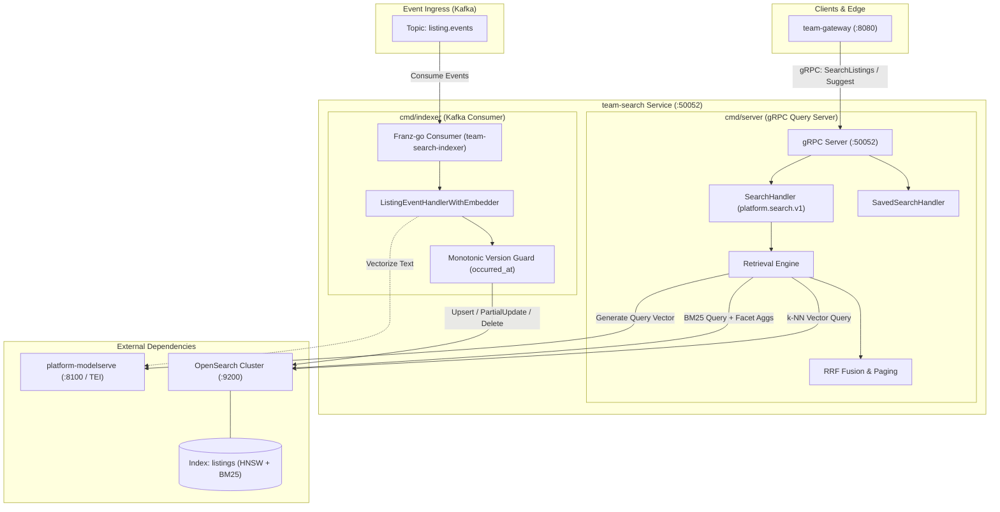
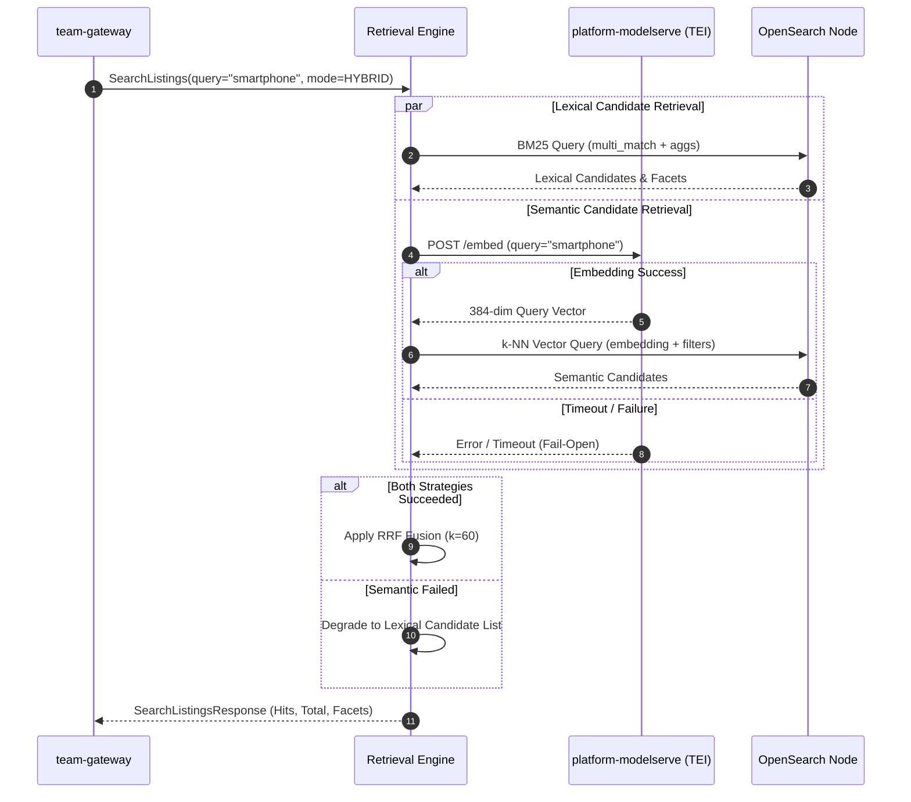

# team-search — Search & Discovery Read-Model Microservice

`team-search` is the high-performance **search and discovery read-model** microservice in the Agora marketplace architecture. Operating under the **CQRS pattern (ADR-0005)**, it consumes product lifecycle events asynchronously from Kafka (`listing.events`) emitted by `team-domain` and projects them into an optimized **OpenSearch** cluster.

It provides sub-millisecond lexical full-text search, dense k-NN vector semantic search, hybrid multi-strategy retrieval with Reciprocal Rank Fusion (RRF), prefix autocomplete, dynamic multi-facet aggregation, and saved search queries via gRPC.

---

## 1. Service Overview & Responsibilities

- **CQRS Read-Model Projection**: Maintains an eventually-consistent, rebuildable read-projection in OpenSearch. Replaying the `listing.events` Kafka topic reconstructs the search index without querying source OLTP databases.
- **Hybrid Multi-Strategy Retrieval**:
  - **Lexical BM25**: Multi-match scoring over `title^2` and `description` with keyword filtering and numeric range checks.
  - **Dense Vector Search**: Lucene-backed HNSW k-NN vector search on 384-dimensional embeddings generated via `platform-modelserve` (Text Embeddings Inference / TEI).
  - **Reciprocal Rank Fusion (RRF)**: In-process score merging combining ranked candidate lists from lexical and semantic pipelines.
  - **Fail-Open Resilience**: Graceful degradation to lexical search if semantic embedding services or vector queries experience latency spikes or outages.
- **Dynamic Faceting & Aggregations**: Concurrent calculation of category terms, seller terms, structured price range buckets, and cumulative review rating floors over filtered hit sets.
- **Type-Ahead Autocomplete**: Fast prefix auto-completion powered by OpenSearch `search_as_you_type` (`bool_prefix` on `title`, `title._2gram`, `title._3gram`).
- **Saved Searches**: Management and retrieval of user-saved search queries and filter presets.
- **Dual Process Architecture**:
  1. `cmd/server`: gRPC query server on `:50052` serving `platform.search.v1.SearchService` and `SavedSearchService`.
  2. `cmd/indexer`: Kafka consumer worker (`team-search-indexer` group) indexing and updating listings in real-time.

---

## 2. Technology Stack & Key Libraries

| Component / Layer | Technology / Library | Version / Details |
|---|---|---|
| **Language & Runtime** | Go | 1.22 |
| **Search & Read Store** | OpenSearch / `opensearch-go/v2` | `v2.3.0` (HNSW k-NN vector + Lexical engine) |
| **Messaging & Events** | Franz-go (`twmb/franz-go`) | `v1.18.0` (Kafka consumer for `listing.events`) |
| **RPC Framework** | gRPC Go / Protobuf | `v1.66.0` / `v1.34.2` (`platform.search.v1`) |
| **ML / Embeddings Integration** | HTTP Client to `platform-modelserve` | 384-dim dense embeddings (TEI) + Cross-Encoder reranker |
| **Observability** | OpenTelemetry Go (`otel`, `otelgrpc`) | `v1.28.0` (Traces exported via OTLP/gRPC `:4317`) |
| **Logging** | Structured Logger (`log/slog`) | JSON formatted logging with span context correlation |

---

## 3. System Architecture Diagram



---

## 4. Internal Package Structure

```
team-search/
├── cmd/
│   ├── indexer/                # Kafka consumer daemon (cmd/indexer/main.go)
│   └── server/                 # gRPC query server daemon (cmd/server/main.go)
├── internal/
│   ├── bootstrap/              # OpenSearch client initialization & lifecycle management
│   ├── config/                 # Environment variables parsing and configuration gate
│   ├── consumer/               # Kafka consumer loop and event dispatchers
│   │   ├── consumer.go         # Franz-go consumer worker pool & lifecycle
│   │   └── listing.go          # ListingChanged / ListingPricingChanged event handlers
│   ├── grpcserver/             # gRPC server construction, interceptors, reflection & health
│   ├── handler/                # gRPC service implementation
│   │   ├── search.go           # SearchListings & Suggest RPC handlers
│   │   └── saved_search.go     # SavedSearch CRUD RPC handlers
│   ├── index/                  # OpenSearch interaction layer
│   │   └── opensearch.go       # Schema mapping, EnsureIndex, Upsert, PartialUpdate, Delete, Search, Suggest
│   ├── interceptor/            # Auth metadata extraction (x-principal-*) & tracing interceptors
│   ├── observability/          # OpenTelemetry tracer & structured slog wrappers
│   ├── repository/             # Saved searches repository
│   └── retrieval/              # Hybrid retrieval & ranking engine
│       ├── embed_client.go     # HTTP client for text vectorization via platform-modelserve
│       ├── engine.go           # Multi-strategy search orchestrator & fail-open logic
│       ├── fusion.go           # Reciprocal Rank Fusion (RRF) algorithm implementation
│       └── rerank_client.go    # Cross-encoder reranking client
├── proto/                      # Vendored protobuf definitions from platform-core
└── generated/                  # Generated Go protobuf code
```

---

## 5. OpenSearch Index Schema & Mappings

The read-model index `listings` is provisioned automatically on boot by `EnsureIndex` with Lucene HNSW k-NN vectors and full-text analyzers:

```json
{
  "settings": {
    "index": {
      "knn": true
    },
    "analysis": {
      "analyzer": {
        "default": { "type": "standard" }
      }
    }
  },
  "mappings": {
    "properties": {
      "id":             { "type": "keyword" },
      "title":          { "type": "search_as_you_type" },
      "description":    { "type": "text" },
      "status":         { "type": "keyword" },
      "currency":       { "type": "keyword" },
      "price":          { "type": "long" },
      "category_id":    { "type": "keyword" },
      "seller_id":      { "type": "keyword" },
      "rating":         { "type": "float" },
      "version":        { "type": "long" },
      "embedding": {
        "type": "knn_vector",
        "dimension": 384,
        "method": {
          "name": "hnsw",
          "engine": "lucene",
          "space_type": "cosinesimil"
        }
      },
      "vector_pending": { "type": "boolean" }
    }
  }
}
```

---

## 6. Key Workflows & Retrieval Engine

### A. CQRS Event Consumption (`listing.events`)
1. **Event Unmarshaling**: `ListingEventHandlerWithEmbedder` reads `platform.events.v1.EventEnvelope`.
2. **Version Guard (AD2)**: Derives monotonic version from `occurred_at` (nanoseconds timestamp). Stale or out-of-order events are rejected by OpenSearch external versioning or painless script guards.
3. **Selective Partial Updates**:
   - `ListingChanged`: Full document upsert or document deletion. Text is vectorized synchronously via `EmbedClient`; if unavailable, `vector_pending: true` is flagged without stalling ingestion.
   - `ListingBaseInfoChanged`: Painless script updates `title`, `description`, `category_id`, `status`, and re-embeds text.
   - `ListingPricingChanged`: Scripted partial update on `price` and `currency` without re-indexing text.
   - `ListingStatusChanged`: Updates status; if `REJECTED`, removes document from index.

### B. Hybrid Retrieval (Lexical + Dense Vector) & RRF Fusion
1. **Query Planning**: Based on `SearchMode` (Lexical, Semantic, or Hybrid):
   - **Lexical**: Constructs OpenSearch `bool` query with `multi_match` over `title^2` and `description` + term filters.
   - **Semantic**: Calls `platform-modelserve` (`POST /embed`) to encode the query into a 384-dim vector, then runs a `knn` vector query against `embedding`.
   - **Hybrid**: Concurrently executes Lexical BM25 and Semantic k-NN vector queries up to `HybridFusionWindow` (default: 200 items).
2. **Reciprocal Rank Fusion (RRF)**: Merges ranked candidate lists from both strategies:
   $$\text{RRF}(d) = \sum_{s \in \{\text{lexical}, \text{semantic}\}} \frac{w_s}{k + r_s(d)}$$
   where $k = 60$, $w_s$ is strategy weight (default: 1.0), and $r_s(d)$ is the 1-based rank position.
3. **Fail-Open Resilience**: If semantic vectorization exceeds timeout (1.5s) or returns an error, the engine automatically falls back to pure BM25 lexical search.
4. **Deep Paging**: Offsets beyond `HybridFusionWindow` automatically fallback to BM25 to avoid heavy memory allocation during fusion.



### C. Autocomplete Suggestions & Dynamic Facets
- **Prefix Autocomplete**: `Suggest` queries the `search_as_you_type` field using `bool_prefix` over `title`, `title._2gram`, and `title._3gram`, deduplicating hits instantly.
- **Facet Aggregations**: Computed concurrently with search hits over the exact post-filter match set:
  - `categories`: Terms aggregation on `category_id` (size: 50).
  - `sellers`: Terms aggregation on `seller_id` (size: 50).
  - `price_ranges`: Keyed range aggregation (`0-100k`, `100k-500k`, `500k-1M`, `1M+`).
  - `ratings`: Filter aggregations for overlapping review floors ($\ge 4.0, \ge 3.0, \ge 2.0, \ge 1.0$).

---

## 7. Configuration & Environment Variables

| Variable | Type | Default | Description |
|---|---|---|---|
| `ENV` | `string` | `local` | Environment mode (`local`, `dev`, `prod`) |
| `LOG_LEVEL` | `string` | `info` | Log verbosity (`debug`, `info`, `warn`, `error`) |
| `LOG_JSON` | `bool` | `true` | Log format in JSON |
| `GRPC_HOST` | `string` | `0.0.0.0` | Bind host for gRPC server |
| `GRPC_PORT` | `int` | `50052` | gRPC server listening port |
| `GRPC_REFLECTION_ENABLED` | `bool` | `true` | Enable gRPC reflection |
| `SHUTDOWN_GRACE_SECONDS` | `float` | `10` | Server shutdown drain timeout |
| `OPENSEARCH_URL` | `string` | `http://localhost:9200` | OpenSearch cluster endpoint |
| `OPENSEARCH_INDEX` | `string` | `listings` | Target index name |
| `KAFKA_ENABLED` | `bool` | `false` | Enable Kafka consumer (required for `cmd/indexer`) |
| `KAFKA_BROKERS` | `string` | `localhost:9092` | Comma-separated Kafka broker addresses |
| `KAFKA_CONSUMER_GROUP` | `string` | `team-search-indexer` | Kafka consumer group name |
| `KAFKA_LISTING_TOPIC` | `string` | `listing.events` | Ingest topic name |
| `MODELSERVE_URL` | `string` | `http://localhost:8100` | Platform modelserve URL for text vectorization |
| `ENABLE_HYBRID_SEARCH` | `bool` | `true` | Enable dense vector + lexical hybrid search |
| `HYBRID_RRF_K` | `int` | `60` | Reciprocal Rank Fusion smoothing parameter |
| `HYBRID_FUSION_WINDOW` | `int` | `200` | Max candidate pool size retrieved per strategy for fusion |
| `OTEL_ENABLED` | `bool` | `false` | Enable OpenTelemetry tracing |
| `OTEL_EXPORTER_OTLP_ENDPOINT` | `string` | `""` | OTLP gRPC collector endpoint (`localhost:4317`) |
| `OTEL_SERVICE_NAME` | `string` | `team-search` | Tracing service name |

---

## 8. How to Run & Verify

### Local Development

```bash
# 1. Start OpenSearch and Redpanda from platform-core infra
cd ../platform-core/infra && docker compose -p platform-core up -d opensearch redpanda

# 2. Configure environment
cd ../../team-search
cp .env.example .env

# 3. Start indexer daemon (consume Kafka -> OpenSearch)
KAFKA_ENABLED=true make indexer

# 4. Start gRPC Search Server (:50052)
make server
```

### Verification via grpcurl

```bash
# Search listings with hybrid retrieval
grpcurl -plaintext -H 'x-principal-scopes: search:read' \
  -d '{"query":"laptop","min_price":5000000,"sort_by":2}' \
  localhost:50052 platform.search.v1.SearchService/SearchListings

# Autocomplete suggestions
grpcurl -plaintext -H 'x-principal-scopes: search:read' \
  -d '{"query":"lap","limit":5}' \
  localhost:50052 platform.search.v1.SearchService/Suggest

# Health check
grpcurl -plaintext localhost:50052 grpc.health.v1.Health/Check
```

### Quality Gate

```bash
make check      # Runs check-env, gofmt, go vet, and unit/integration tests
```

